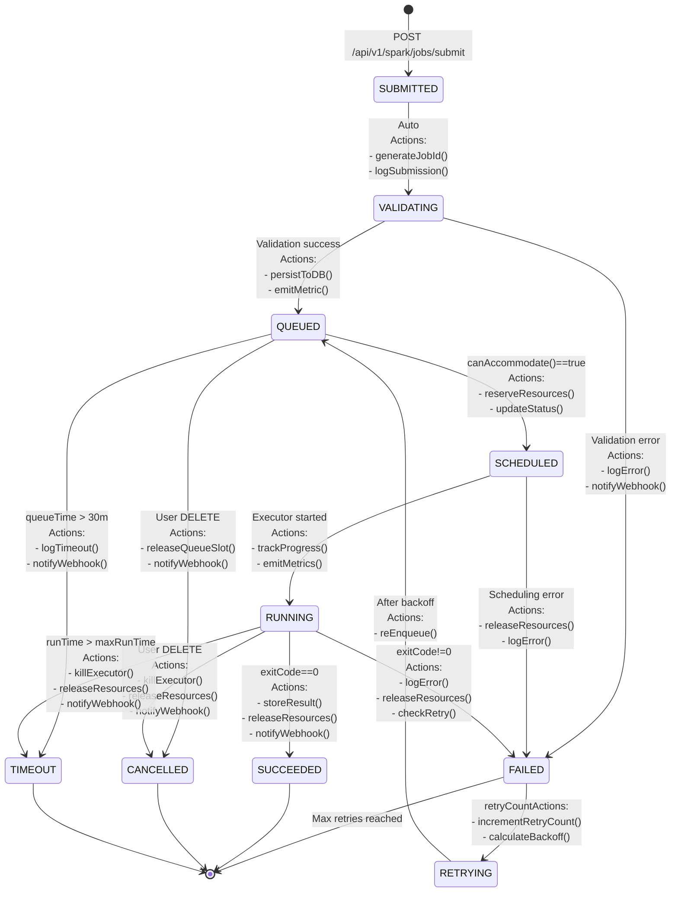

# Libra Spark Facade Service - Detailed Design Document

**Version:** 1.0
**Date:** 2025-12-02
**Status:** Draft

---

## Table of Contents

1. [Component Specifications](#component-specifications)
2. [Class Diagrams](#class-diagrams)
3. [Sequence Diagrams](#sequence-diagrams)
4. [Job Lifecycle State Machine (Detailed)](#job-lifecycle-state-machine-detailed)
5. [Database Schema](#database-schema)
6. [API Specifications](#api-specifications)
7. [Configuration Reference](#configuration-reference)
8. [Error Handling](#error-handling)
9. [Performance Considerations](#performance-considerations)
10. [Testing Strategy](#testing-strategy)

---

## Component Specifications

### 1. API Layer

#### SparkJobController

**Responsibility:** Handle HTTP requests for job submission and management

**Location:** `src/main/java/com/whereq/libra/controller/SparkJobController.java`

```java
@RestController
@RequestMapping("/api/v1/spark/jobs")
@Validated
public class SparkJobController {

    @Autowired
    private JobSubmissionService jobSubmissionService;

    @Autowired
    private JobStatusService jobStatusService;

    @PostMapping("/submit")
    public Mono<ResponseEntity<JobSubmitResponse>> submitJob(
            @Valid @RequestBody SparkJobRequest request,
            @RequestHeader("Authorization") String authHeader) {

        return jobSubmissionService.submitJob(request, extractUserId(authHeader))
            .map(response -> ResponseEntity
                .status(HttpStatus.ACCEPTED)
                .location(URI.create("/api/v1/spark/jobs/" + response.getJobId()))
                .body(response))
            .onErrorResume(ValidationException.class, e ->
                Mono.just(ResponseEntity.badRequest().body(
                    JobSubmitResponse.error(e.getMessage()))))
            .onErrorResume(QuotaExceededException.class, e ->
                Mono.just(ResponseEntity.status(HttpStatus.TOO_MANY_REQUESTS).body(
                    JobSubmitResponse.error(e.getMessage()))));
    }

    @GetMapping("/{jobId}")
    public Mono<ResponseEntity<JobStatusResponse>> getJobStatus(
            @PathVariable String jobId,
            @RequestHeader("Authorization") String authHeader) {

        return jobStatusService.getStatus(jobId, extractUserId(authHeader))
            .map(ResponseEntity::ok)
            .switchIfEmpty(Mono.just(ResponseEntity.notFound().build()));
    }

    @GetMapping("/{jobId}/result")
    public Mono<ResponseEntity<JobResultResponse>> getJobResult(
            @PathVariable String jobId,
            @RequestHeader("Authorization") String authHeader) {

        return jobStatusService.getResult(jobId, extractUserId(authHeader))
            .map(ResponseEntity::ok)
            .switchIfEmpty(Mono.just(ResponseEntity.notFound().build()));
    }

    @DeleteMapping("/{jobId}")
    public Mono<ResponseEntity<JobCancellationResponse>> cancelJob(
            @PathVariable String jobId,
            @RequestHeader("Authorization") String authHeader) {

        return jobSubmissionService.cancelJob(jobId, extractUserId(authHeader))
            .map(ResponseEntity::ok)
            .switchIfEmpty(Mono.just(ResponseEntity.notFound().build()));
    }

    @GetMapping
    public Mono<ResponseEntity<JobListResponse>> listJobs(
            @RequestParam(required = false) JobStatus status,
            @RequestParam(defaultValue = "10") int limit,
            @RequestParam(defaultValue = "0") int offset,
            @RequestHeader("Authorization") String authHeader) {

        return jobStatusService.listJobs(extractUserId(authHeader), status, limit, offset)
            .map(ResponseEntity::ok);
    }
}
```

**Error Responses:**

| Status Code | Error Type | Description |
|-------------|-----------|-------------|
| 400 | ValidationException | Invalid request payload |
| 401 | UnauthorizedException | Missing or invalid auth token |
| 403 | ForbiddenException | Insufficient permissions |
| 404 | NotFoundException | Job not found |
| 429 | QuotaExceededException | Queue full or rate limit exceeded |
| 500 | InternalServerError | Unexpected server error |

---

### 2. Service Layer

#### JobSubmissionService

**Responsibility:** Orchestrate job submission, validation, and admission control

**Location:** `src/main/java/com/whereq/libra/service/JobSubmissionService.java`

```java
@Service
public class JobSubmissionService {

    @Autowired
    private JobValidator jobValidator;

    @Autowired
    private ResourceCalculator resourceCalculator;

    @Autowired
    private AdmissionController admissionController;

    @Autowired
    private JobQueue jobQueue;

    @Autowired
    private JobStatusTracker statusTracker;

    @Autowired
    private ExecutionStrategyFactory executionStrategyFactory;

    public Mono<JobSubmitResponse> submitJob(SparkJobRequest request, String userId) {
        String jobId = generateJobId();

        return Mono.just(jobId)
            // 1. Validate request
            .doOnNext(id -> {
                statusTracker.updateStatus(id, JobStatus.SUBMITTED);
                statusTracker.updateStatus(id, JobStatus.VALIDATING);
            })
            .flatMap(id -> validateJob(request)
                .thenReturn(id)
                .onErrorResume(ValidationException.class, e -> {
                    statusTracker.updateStatus(id, JobStatus.FAILED, e.getMessage());
                    return Mono.error(e);
                }))

            // 2. Calculate resource requirements
            .map(id -> {
                ResourceRequirement req = resourceCalculator.calculate(request);
                return new JobSubmission(id, userId, request, req);
            })

            // 3. Check admission control
            .flatMap(submission -> admissionController.admitJob(submission)
                .flatMap(decision -> {
                    switch (decision) {
                        case ADMIT:
                            return admitJobImmediately(submission);
                        case QUEUE:
                            return queueJob(submission);
                        case REJECT:
                            return Mono.error(new QuotaExceededException(
                                "Queue full, cannot accept more jobs"));
                    }
                    return Mono.empty();
                }))

            // 4. Return response
            .map(submission -> JobSubmitResponse.builder()
                .jobId(submission.getJobId())
                .status(statusTracker.getStatus(submission.getJobId()))
                .submittedAt(Instant.now())
                .build());
    }

    private Mono<JobSubmission> admitJobImmediately(JobSubmission submission) {
        return Mono.just(submission)
            .doOnNext(s -> statusTracker.updateStatus(s.getJobId(), JobStatus.SCHEDULED))
            .doOnNext(s -> jobQueue.enqueue(s));
    }

    private Mono<JobSubmission> queueJob(JobSubmission submission) {
        return Mono.just(submission)
            .doOnNext(s -> statusTracker.updateStatus(s.getJobId(), JobStatus.QUEUED))
            .doOnNext(s -> jobQueue.enqueue(s));
    }

    public Mono<JobCancellationResponse> cancelJob(String jobId, String userId) {
        return Mono.fromCallable(() -> {
            // Verify ownership
            if (!statusTracker.isOwner(jobId, userId)) {
                throw new ForbiddenException("Not authorized to cancel this job");
            }

            JobStatus currentStatus = statusTracker.getStatus(jobId);

            // Can only cancel QUEUED or RUNNING jobs
            if (currentStatus != JobStatus.QUEUED && currentStatus != JobStatus.RUNNING) {
                throw new IllegalStateException(
                    "Cannot cancel job in status: " + currentStatus);
            }

            // Update status
            statusTracker.updateStatus(jobId, JobStatus.CANCELLED);

            // Remove from queue or kill executor
            if (currentStatus == JobStatus.QUEUED) {
                jobQueue.remove(jobId);
            } else {
                // Kill running executor
                executionStrategyFactory.getExecutor(jobId).cancel(jobId);
            }

            return JobCancellationResponse.builder()
                .jobId(jobId)
                .status(JobStatus.CANCELLED)
                .cancelledAt(Instant.now())
                .build();
        }).subscribeOn(Schedulers.boundedElastic());
    }

    private String generateJobId() {
        return "job-" + UUID.randomUUID().toString();
    }

    private Mono<Void> validateJob(SparkJobRequest request) {
        return Mono.fromRunnable(() -> jobValidator.validate(request))
            .subscribeOn(Schedulers.boundedElastic())
            .then();
    }
}
```

---

#### AsyncJobExecutor

**Responsibility:** Background job processor that consumes from queue

**Location:** `src/main/java/com/whereq/libra/service/AsyncJobExecutor.java`

```java
@Service
public class AsyncJobExecutor {

    @Autowired
    private JobQueue jobQueue;

    @Autowired
    private JobStatusTracker statusTracker;

    @Autowired
    private ExecutionStrategyFactory executionStrategyFactory;

    @Autowired
    private ResourceMonitor resourceMonitor;

    @Autowired
    private JobResultStore resultStore;

    @Autowired
    private WebhookNotifier webhookNotifier;

    @PostConstruct
    public void startJobProcessor() {
        logger.info("Starting async job processor");

        jobQueue.consumeAsFlux()
            .filter(job -> resourceMonitor.canAccommodate(job.getResourceRequirement()))
            .flatMap(job -> executeJob(job)
                .subscribeOn(Schedulers.boundedElastic())
                .doOnSuccess(result -> handleSuccess(job, result))
                .doOnError(error -> handleError(job, error))
                .onErrorResume(e -> Mono.empty())  // Continue processing next job
            )
            .doOnError(e -> logger.error("Fatal error in job processor", e))
            .retry()  // Restart on fatal error
            .subscribe();

        logger.info("Async job processor started");
    }

    private Mono<JobResult> executeJob(QueuedJob job) {
        return Mono.fromCallable(() -> {
            // Update status
            statusTracker.updateStatus(job.getJobId(), JobStatus.SCHEDULED);

            // Reserve resources
            resourceMonitor.reserveResources(
                job.getJobId(),
                job.getResourceRequirement()
            );

            // Select executor
            JobExecutor executor = executionStrategyFactory.selectExecutor(
                job.getRequest()
            );

            // Update status
            statusTracker.updateStatus(job.getJobId(), JobStatus.RUNNING);

            // Execute job (blocking)
            return executor.executeJob(job);
        })
        .flatMap(Mono::just)
        .timeout(Duration.ofMinutes(job.getRequest().getTimeoutMinutes()))
        .doFinally(signal -> resourceMonitor.releaseResources(job.getJobId()));
    }

    private void handleSuccess(QueuedJob job, JobResult result) {
        logger.info("Job {} completed successfully", job.getJobId());

        // Update status
        statusTracker.updateStatus(
            job.getJobId(),
            JobStatus.SUCCEEDED,
            result
        );

        // Store result
        resultStore.save(job.getJobId(), result);

        // Notify webhooks
        webhookNotifier.notify(
            job.getRequest().getNotifications(),
            job.getJobId(),
            JobStatus.SUCCEEDED,
            result
        );

        // Acknowledge queue
        jobQueue.acknowledge(job.getJobId());
    }

    private void handleError(QueuedJob job, Throwable error) {
        logger.error("Job {} failed: {}", job.getJobId(), error.getMessage(), error);

        int retryCount = statusTracker.getRetryCount(job.getJobId());
        int maxRetries = job.getRequest().getRetryPolicy().getMaxRetries();

        if (retryCount < maxRetries) {
            // Retry with exponential backoff
            logger.info("Retrying job {} (attempt {}/{})",
                job.getJobId(), retryCount + 1, maxRetries);

            statusTracker.updateStatus(job.getJobId(), JobStatus.RETRYING);
            statusTracker.incrementRetryCount(job.getJobId());

            long backoffMs = calculateBackoff(
                retryCount,
                job.getRequest().getRetryPolicy()
            );

            // Re-enqueue after backoff
            Mono.delay(Duration.ofMillis(backoffMs))
                .doOnNext(x -> {
                    statusTracker.updateStatus(job.getJobId(), JobStatus.QUEUED);
                    jobQueue.enqueue(job);
                })
                .subscribe();
        } else {
            // Max retries exceeded
            logger.warn("Job {} failed permanently after {} retries",
                job.getJobId(), maxRetries);

            statusTracker.updateStatus(
                job.getJobId(),
                JobStatus.FAILED,
                error.getMessage()
            );

            // Notify webhooks
            webhookNotifier.notify(
                job.getRequest().getNotifications(),
                job.getJobId(),
                JobStatus.FAILED,
                error
            );

            // Acknowledge queue (remove from queue)
            jobQueue.acknowledge(job.getJobId());
        }
    }

    private long calculateBackoff(int retryCount, RetryPolicy policy) {
        long initialInterval = policy.getInitialIntervalMs();
        int multiplier = policy.getBackoffMultiplier();
        long maxInterval = policy.getMaxIntervalMs();

        long backoff = (long) (initialInterval * Math.pow(multiplier, retryCount));
        return Math.min(backoff, maxInterval);
    }
}
```

---

### 3. Queue Layer

#### JobQueue (Redis Implementation)

**Responsibility:** Persistent job queue using Redis Streams

**Location:** `src/main/java/com/whereq/libra/queue/RedisJobQueue.java`

```java
@Service
public class RedisJobQueue implements JobQueue {

    private static final String STREAM_KEY = "libra:jobs:pending";
    private static final String CONSUMER_GROUP = "libra-processors";
    private static final String CONSUMER_NAME = generateConsumerName();

    @Autowired
    private RedisTemplate<String, String> redisTemplate;

    @Autowired
    private ObjectMapper objectMapper;

    @PostConstruct
    public void initialize() {
        // Create consumer group if not exists
        try {
            redisTemplate.opsForStream()
                .createGroup(STREAM_KEY, CONSUMER_GROUP);
            logger.info("Created consumer group: {}", CONSUMER_GROUP);
        } catch (Exception e) {
            logger.info("Consumer group already exists: {}", CONSUMER_GROUP);
        }
    }

    @Override
    public void enqueue(QueuedJob job) {
        try {
            Map<String, String> record = Map.of(
                "jobId", job.getJobId(),
                "userId", job.getUserId(),
                "payload", objectMapper.writeValueAsString(job.getRequest()),
                "resourceRequirement", objectMapper.writeValueAsString(
                    job.getResourceRequirement()),
                "enqueuedAt", Instant.now().toString()
            );

            RecordId recordId = redisTemplate.opsForStream()
                .add(STREAM_KEY, record);

            logger.info("Enqueued job {} with recordId {}", job.getJobId(), recordId);

        } catch (JsonProcessingException e) {
            throw new RuntimeException("Failed to serialize job", e);
        }
    }

    @Override
    public Flux<QueuedJob> consumeAsFlux() {
        return Flux.create(sink -> {
            while (true) {
                try {
                    // Read from stream with blocking (XREADGROUP)
                    List<MapRecord<String, String, String>> records =
                        redisTemplate.opsForStream()
                            .read(Consumer.from(CONSUMER_GROUP, CONSUMER_NAME),
                                  StreamReadOptions.empty()
                                      .count(1)
                                      .block(Duration.ofSeconds(5)),
                                  StreamOffset.create(STREAM_KEY, ReadOffset.lastConsumed()));

                    if (records != null && !records.isEmpty()) {
                        for (MapRecord<String, String, String> record : records) {
                            QueuedJob job = deserializeJob(record);
                            sink.next(job);
                        }
                    }

                } catch (Exception e) {
                    logger.error("Error reading from stream", e);
                    sink.error(e);
                    break;
                }
            }
        }, FluxSink.OverflowStrategy.BUFFER)
        .subscribeOn(Schedulers.boundedElastic());
    }

    @Override
    public void acknowledge(String jobId) {
        // Find the record ID for this job (stored in metadata)
        String recordId = findRecordId(jobId);

        if (recordId != null) {
            redisTemplate.opsForStream()
                .acknowledge(STREAM_KEY, CONSUMER_GROUP, recordId);
            logger.info("Acknowledged job {}", jobId);
        }
    }

    @Override
    public void remove(String jobId) {
        // Remove from pending entries
        String recordId = findRecordId(jobId);
        if (recordId != null) {
            redisTemplate.opsForStream().delete(STREAM_KEY, recordId);
            logger.info("Removed job {} from queue", jobId);
        }
    }

    @Override
    public long size() {
        Long size = redisTemplate.opsForStream().size(STREAM_KEY);
        return size != null ? size : 0;
    }

    private QueuedJob deserializeJob(MapRecord<String, String, String> record) {
        try {
            Map<String, String> value = record.getValue();

            String jobId = value.get("jobId");
            String userId = value.get("userId");
            SparkJobRequest request = objectMapper.readValue(
                value.get("payload"),
                SparkJobRequest.class
            );
            ResourceRequirement resourceRequirement = objectMapper.readValue(
                value.get("resourceRequirement"),
                ResourceRequirement.class
            );

            return QueuedJob.builder()
                .jobId(jobId)
                .userId(userId)
                .request(request)
                .resourceRequirement(resourceRequirement)
                .recordId(record.getId().getValue())
                .build();

        } catch (JsonProcessingException e) {
            throw new RuntimeException("Failed to deserialize job", e);
        }
    }

    private String findRecordId(String jobId) {
        // Search pending entries for this jobId
        List<MapRecord<String, String, String>> records =
            redisTemplate.opsForStream()
                .pending(STREAM_KEY, CONSUMER_GROUP)
                .stream()
                .filter(pendingMessage -> {
                    // Read the record
                    List<MapRecord<String, String, String>> msgs =
                        redisTemplate.opsForStream()
                            .range(STREAM_KEY, Range.closed(
                                pendingMessage.getId().getValue(),
                                pendingMessage.getId().getValue()));
                    return !msgs.isEmpty() &&
                           msgs.get(0).getValue().get("jobId").equals(jobId);
                })
                .findFirst()
                .map(pendingMessage -> {
                    List<MapRecord<String, String, String>> msgs =
                        redisTemplate.opsForStream()
                            .range(STREAM_KEY, Range.closed(
                                pendingMessage.getId().getValue(),
                                pendingMessage.getId().getValue()));
                    return msgs.isEmpty() ? null : msgs.get(0);
                })
                .orElse(null);

        return records != null ? records.getId().getValue() : null;
    }

    private static String generateConsumerName() {
        try {
            return InetAddress.getLocalHost().getHostName() + "-" +
                   ProcessHandle.current().pid();
        } catch (UnknownHostException e) {
            return "libra-" + UUID.randomUUID().toString();
        }
    }
}
```

---

### 4. Resource Management

#### ResourceMonitor

**Responsibility:** Track resource usage and availability

**Location:** `src/main/java/com/whereq/libra/resource/ResourceMonitor.java`

```java
@Component
public class ResourceMonitor {

    @Value("${libra.resources.limits.cpu-cores:16}")
    private int cpuLimitCores;

    @Value("${libra.resources.limits.memory-gb:64}")
    private long memoryLimitGB;

    @Value("${libra.resources.limits.max-concurrent-jobs:10}")
    private int maxConcurrentJobs;

    private final ConcurrentHashMap<String, ResourceUsage> activeJobs =
        new ConcurrentHashMap<>();

    @Autowired
    private MeterRegistry meterRegistry;

    @PostConstruct
    public void initialize() {
        // Register gauges
        Gauge.builder("libra.resources.cpu.limit", () -> cpuLimitCores)
            .register(meterRegistry);

        Gauge.builder("libra.resources.memory.limit", () -> memoryLimitGB)
            .register(meterRegistry);

        Gauge.builder("libra.resources.cpu.used", this::getCpuUsage)
            .register(meterRegistry);

        Gauge.builder("libra.resources.memory.used", this::getMemoryUsage)
            .register(meterRegistry);

        Gauge.builder("libra.resources.jobs.active", activeJobs::size)
            .register(meterRegistry);
    }

    public boolean canAccommodate(ResourceRequirement requirement) {
        ResourceUsage current = calculateCurrentUsage();

        boolean cpuAvailable =
            (current.getCpuCores() + requirement.getTotalCores()) <= cpuLimitCores;

        boolean memoryAvailable =
            (current.getMemoryGB() + requirement.getTotalMemoryGB()) <= memoryLimitGB;

        boolean slotsAvailable =
            activeJobs.size() < maxConcurrentJobs;

        return cpuAvailable && memoryAvailable && slotsAvailable;
    }

    public void reserveResources(String jobId, ResourceRequirement requirement) {
        ResourceUsage usage = new ResourceUsage(
            requirement.getTotalCores(),
            requirement.getTotalMemoryGB()
        );

        activeJobs.put(jobId, usage);

        logger.info("Reserved resources for job {}: {} cores, {} GB",
            jobId, usage.getCpuCores(), usage.getMemoryGB());

        logResourceStatus();
    }

    public void releaseResources(String jobId) {
        ResourceUsage released = activeJobs.remove(jobId);

        if (released != null) {
            logger.info("Released resources for job {}: {} cores, {} GB",
                jobId, released.getCpuCores(), released.getMemoryGB());

            logResourceStatus();
        }
    }

    private ResourceUsage calculateCurrentUsage() {
        return activeJobs.values().stream()
            .reduce(ResourceUsage.ZERO, ResourceUsage::add);
    }

    private double getCpuUsage() {
        return calculateCurrentUsage().getCpuCores();
    }

    private double getMemoryUsage() {
        return calculateCurrentUsage().getMemoryGB();
    }

    private void logResourceStatus() {
        ResourceUsage current = calculateCurrentUsage();

        logger.info("Resource status: CPU {}/{} cores ({:.1f}%), Memory {}/{} GB ({:.1f}%), Jobs {}/{}",
            current.getCpuCores(), cpuLimitCores,
            100.0 * current.getCpuCores() / cpuLimitCores,
            current.getMemoryGB(), memoryLimitGB,
            100.0 * current.getMemoryGB() / memoryLimitGB,
            activeJobs.size(), maxConcurrentJobs);
    }

    @Scheduled(fixedRate = 5000)
    public void monitorResources() {
        ResourceUsage current = calculateCurrentUsage();

        double cpuPercent = 100.0 * current.getCpuCores() / cpuLimitCores;
        double memoryPercent = 100.0 * current.getMemoryGB() / memoryLimitGB;

        // Alert if usage exceeds thresholds
        if (cpuPercent > 90) {
            logger.warn("High CPU usage: {:.1f}%", cpuPercent);
        }

        if (memoryPercent > 90) {
            logger.warn("High memory usage: {:.1f}%", memoryPercent);
        }
    }
}
```

---

### 5. Execution Layer

#### ExecutionStrategyFactory

**Responsibility:** Select appropriate executor based on execution mode

**Location:** `src/main/java/com/whereq/libra/executor/ExecutionStrategyFactory.java`

```java
@Service
public class ExecutionStrategyFactory {

    @Autowired
    private InClusterExecutor inClusterExecutor;

    @Autowired
    private SparkSubmitExecutor sparkSubmitExecutor;

    @Autowired
    private KubernetesOperatorExecutor kubernetesOperatorExecutor;

    @Autowired
    private ResourceCalculator resourceCalculator;

    @Autowired
    private LibraProperties properties;

    public JobExecutor selectExecutor(SparkJobRequest request) {
        String mode = request.getExecutionMode();

        // Explicit mode selection
        if (mode != null && !mode.equalsIgnoreCase("auto")) {
            return getExecutorByMode(ExecutionMode.valueOf(mode.toUpperCase()));
        }

        // Auto-selection based on resource requirements
        ResourceRequirement req = resourceCalculator.calculate(request);

        ExecutionMode selectedMode = autoSelectMode(req);

        logger.info("Auto-selected execution mode {} for job with {} executors, {} GB memory",
            selectedMode, req.getExecutorCount(), req.getTotalMemoryGB());

        return getExecutorByMode(selectedMode);
    }

    private ExecutionMode autoSelectMode(ResourceRequirement req) {
        // Large jobs → Kubernetes
        if (req.getExecutorCount() > 20 || req.getTotalMemoryGB() > 100) {
            if (properties.getExecution().getModes().getKubernetes().isEnabled()) {
                return ExecutionMode.KUBERNETES;
            }
        }

        // Medium jobs → spark-submit
        if (req.getExecutorCount() > 5 || req.getTotalMemoryGB() > 32) {
            if (properties.getExecution().getModes().getSparkSubmit().isEnabled()) {
                return ExecutionMode.SPARK_SUBMIT;
            }
        }

        // Small jobs → in-cluster
        if (properties.getExecution().getModes().getInCluster().isEnabled()) {
            return ExecutionMode.IN_CLUSTER;
        }

        // Fallback to spark-submit
        return ExecutionMode.SPARK_SUBMIT;
    }

    private JobExecutor getExecutorByMode(ExecutionMode mode) {
        return switch (mode) {
            case IN_CLUSTER -> inClusterExecutor;
            case SPARK_SUBMIT -> sparkSubmitExecutor;
            case KUBERNETES -> kubernetesOperatorExecutor;
        };
    }
}
```

---

#### KubernetesOperatorExecutor

**Responsibility:** Execute jobs via Spark Operator (SparkApplication CRD)

**Location:** `src/main/java/com/whereq/libra/executor/KubernetesOperatorExecutor.java`

```java
@Service
public class KubernetesOperatorExecutor implements JobExecutor {

    @Autowired
    private KubernetesClient kubernetesClient;

    @Autowired
    private LibraProperties properties;

    @Override
    public Mono<JobResult> executeJob(QueuedJob job) {
        return Mono.fromCallable(() -> {
            // Build SparkApplication CRD
            SparkApplication sparkApp = buildSparkApplication(job);

            // Create in Kubernetes
            String namespace = properties.getExecution()
                .getModes()
                .getKubernetes()
                .getNamespace();

            kubernetesClient.resources(SparkApplication.class)
                .inNamespace(namespace)
                .create(sparkApp);

            String appName = sparkApp.getMetadata().getName();
            logger.info("Created SparkApplication: {}", appName);

            return appName;
        })
        .subscribeOn(Schedulers.boundedElastic())
        .flatMap(this::pollSparkApplicationStatus);
    }

    private SparkApplication buildSparkApplication(QueuedJob job) {
        SparkJobRequest request = job.getRequest();
        Map<String, String> sparkConfig = request.getSparkConfig();

        String appName = "spark-job-" + job.getJobId();
        String namespace = properties.getExecution()
            .getModes()
            .getKubernetes()
            .getNamespace();
        String image = properties.getExecution()
            .getModes()
            .getKubernetes()
            .getImage();

        // Build SparkApplication spec
        return new SparkApplicationBuilder()
            .withNewMetadata()
                .withName(appName)
                .withNamespace(namespace)
                .addToLabels("libra-job-id", job.getJobId())
                .addToLabels("libra-user-id", job.getUserId())
            .endMetadata()
            .withNewSpec()
                .withType(getSparkType(request.getKind()))
                .withMode("cluster")
                .withImage(image)
                .withImagePullPolicy("IfNotPresent")
                .withMainApplicationFile(getMainApplicationFile(request))
                .withMainClass(request.getMainClass())
                .withArguments(request.getArgs())
                .withSparkVersion("4.0.1")
                .withRestartPolicy(new RestartPolicyBuilder()
                    .withType("Never")
                    .build())
                .withNewDriver()
                    .withCores(parseInt(sparkConfig.getOrDefault("spark.driver.cores", "1")))
                    .withMemory(sparkConfig.getOrDefault("spark.driver.memory", "2g"))
                    .withServiceAccount(properties.getExecution()
                        .getModes()
                        .getKubernetes()
                        .getServiceAccount())
                .endDriver()
                .withNewExecutor()
                    .withCores(parseInt(sparkConfig.getOrDefault("spark.executor.cores", "2")))
                    .withInstances(parseInt(sparkConfig.getOrDefault("spark.executor.instances", "2")))
                    .withMemory(sparkConfig.getOrDefault("spark.executor.memory", "4g"))
                .endExecutor()
            .endSpec()
            .build();
    }

    private Mono<JobResult> pollSparkApplicationStatus(String appName) {
        String namespace = properties.getExecution()
            .getModes()
            .getKubernetes()
            .getNamespace();

        return Mono.defer(() -> {
            SparkApplication app = kubernetesClient
                .resources(SparkApplication.class)
                .inNamespace(namespace)
                .withName(appName)
                .get();

            if (app == null) {
                return Mono.error(new RuntimeException(
                    "SparkApplication not found: " + appName));
            }

            String state = app.getStatus().getApplicationState().getState();

            return switch (state) {
                case "COMPLETED" -> Mono.just(buildSuccessResult(app));
                case "FAILED" -> Mono.error(new RuntimeException(
                    "SparkApplication failed: " + app.getStatus().getApplicationState().getErrorMessage()));
                case "UNKNOWN" -> Mono.error(new RuntimeException(
                    "SparkApplication in UNKNOWN state"));
                default -> Mono.delay(Duration.ofSeconds(5))
                    .flatMap(x -> pollSparkApplicationStatus(appName));
            };
        });
    }

    private JobResult buildSuccessResult(SparkApplication app) {
        return JobResult.builder()
            .jobId(app.getMetadata().getLabels().get("libra-job-id"))
            .status(JobStatus.SUCCEEDED)
            .output("SparkApplication completed successfully")
            .executionTimeSeconds(calculateExecutionTime(app))
            .build();
    }

    private String getSparkType(String kind) {
        return switch (kind) {
            case "jar", "jar-class" -> "Scala";
            case "python", "python-file" -> "Python";
            default -> "Scala";
        };
    }

    private String getMainApplicationFile(SparkJobRequest request) {
        return switch (request.getKind()) {
            case "jar", "jar-class" -> request.getJarPath();
            case "python-file" -> request.getFilePath();
            default -> null;
        };
    }

    private int parseInt(String value) {
        return Integer.parseInt(value);
    }

    private long calculateExecutionTime(SparkApplication app) {
        // Extract from app status timestamps
        return 0; // Placeholder
    }
}
```

---

## Class Diagrams

### Core Domain Model

```
┌─────────────────────────────────────────────────────────────┐
│                       Domain Model                           │
└─────────────────────────────────────────────────────────────┘

┌──────────────────────┐
│  SparkJobRequest     │
├──────────────────────┤
│ - code: String       │
│ - kind: String       │
│ - executionMode: String │
│ - sparkConfig: Map   │
│ - priority: int      │
│ - retryPolicy: RetryPolicy │
│ - notifications: Notifications │
└──────────────────────┘
          │
          │ has
          ▼
┌──────────────────────┐
│  ResourceRequirement │
├──────────────────────┤
│ - executorCount: int │
│ - totalCores: int    │
│ - totalMemoryMB: long│
└──────────────────────┘

┌──────────────────────┐
│  QueuedJob           │
├──────────────────────┤
│ - jobId: String      │
│ - userId: String     │
│ - request: SparkJobRequest │
│ - resourceReq: ResourceRequirement │
│ - recordId: String   │
└──────────────────────┘

┌──────────────────────┐       ┌──────────────────────┐
│  JobStatus (enum)    │       │  ExecutionMode (enum)│
├──────────────────────┤       ├──────────────────────┤
│ - SUBMITTED          │       │ - IN_CLUSTER         │
│ - VALIDATING         │       │ - SPARK_SUBMIT       │
│ - QUEUED             │       │ - KUBERNETES         │
│ - SCHEDULED          │       └──────────────────────┘
│ - RUNNING            │
│ - SUCCEEDED          │
│ - FAILED             │
│ - CANCELLED          │
│ - TIMEOUT            │
│ - RETRYING           │
└──────────────────────┘

┌──────────────────────┐
│  JobResult           │
├──────────────────────┤
│ - jobId: String      │
│ - status: JobStatus  │
│ - output: String     │
│ - result: JsonNode   │
│ - executionTimeSeconds: long │
└──────────────────────┘
```

### Executor Interface Hierarchy

```
                    ┌───────────────┐
                    │ <<interface>> │
                    │  JobExecutor  │
                    ├───────────────┤
                    │ + executeJob(): Mono<JobResult> │
                    │ + cancel(): void │
                    └───────┬───────┘
                            │
                ┌───────────┼───────────┐
                │           │           │
       ┌────────▼────────┐ │ ┌─────────▼──────────┐
       │ InClusterExecutor│ │ │SparkSubmitExecutor │
       ├─────────────────┤ │ ├────────────────────┤
       │ - sessionManager│ │ │ - processBuilder   │
       │ - jarExecutor   │ │ │ - timeout          │
       └─────────────────┘ │ └────────────────────┘
                           │
                ┌──────────▼────────────────┐
                │KubernetesOperatorExecutor │
                ├───────────────────────────┤
                │ - k8sClient               │
                │ - namespace               │
                └───────────────────────────┘
```

---

## Sequence Diagrams

### Job Submission Flow

```
Client    Controller    Service    Validator    Calculator    Admission    Queue    StatusTracker
  │           │            │            │            │             │          │          │
  │  POST     │            │            │            │             │          │          │
  │──────────>│            │            │            │             │          │          │
  │           │ submitJob()│            │            │             │          │          │
  │           │───────────>│            │            │             │          │          │
  │           │            │ SUBMITTED  │            │             │          │          │
  │           │            │────────────────────────────────────────────────>│          │
  │           │            │ validate() │            │             │          │          │
  │           │            │───────────>│            │             │          │          │
  │           │            │    OK      │            │             │          │          │
  │           │            │<───────────│            │             │          │          │
  │           │            │ calculate()│            │             │          │          │
  │           │            │────────────────────────>│             │          │          │
  │           │            │ ResourceReq│            │             │          │          │
  │           │            │<────────────────────────│             │          │          │
  │           │            │ admitJob() │            │             │          │          │
  │           │            │────────────────────────────────────────>│          │          │
  │           │            │  QUEUE     │            │             │          │          │
  │           │            │<────────────────────────────────────────│          │          │
  │           │            │ QUEUED     │            │             │          │          │
  │           │            │────────────────────────────────────────────────>│          │
  │           │            │ enqueue()  │            │             │          │          │
  │           │            │─────────────────────────────────────────────────>│          │
  │           │            │            │            │             │          │          │
  │           │  Response  │            │            │             │          │          │
  │           │<───────────│            │            │             │          │          │
  │  202      │            │            │            │             │          │          │
  │<──────────│            │            │            │             │          │          │
  │ {jobId}   │            │            │            │             │          │          │
```

### Background Job Execution Flow

```
Queue    AsyncExecutor    ResourceMonitor    Executor    StatusTracker    WebhookNotifier
  │            │                 │               │              │                 │
  │ consume()  │                 │               │              │                 │
  │───────────>│                 │               │              │                 │
  │ QueuedJob  │                 │               │              │                 │
  │<───────────│                 │               │              │                 │
  │            │ canAccommodate()│               │              │                 │
  │            │────────────────>│               │              │                 │
  │            │      true       │               │              │                 │
  │            │<────────────────│               │              │                 │
  │            │ SCHEDULED       │               │              │                 │
  │            │─────────────────────────────────────────────────>│                 │
  │            │ reserveResources()              │              │                 │
  │            │────────────────>│               │              │                 │
  │            │ executeJob()    │               │              │                 │
  │            │─────────────────────────────────>│              │                 │
  │            │ RUNNING         │               │              │                 │
  │            │─────────────────────────────────────────────────>│                 │
  │            │                 │        [Spark executes]      │                 │
  │            │                 │               │              │                 │
  │            │ JobResult       │               │              │                 │
  │            │<─────────────────────────────────│              │                 │
  │            │ SUCCEEDED       │               │              │                 │
  │            │─────────────────────────────────────────────────>│                 │
  │            │ notify()        │               │              │                 │
  │            │─────────────────────────────────────────────────────────────────>│
  │            │ releaseResources()              │              │                 │
  │            │────────────────>│               │              │                 │
  │  ack()     │                 │               │              │                 │
  │<───────────│                 │               │              │                 │
```

---

## Job Lifecycle State Machine (Detailed)

### State Transition Matrix

| From State | To State | Trigger | Pre-Condition | Post-Action | Timeout |
|------------|----------|---------|---------------|-------------|---------|
| **SUBMITTED** | VALIDATING | Auto | Job received | Log submission, assign jobId | 1s |
| **VALIDATING** | QUEUED | Validation pass | Payload valid | Persist to DB, emit metric | 5s |
| **VALIDATING** | FAILED | Validation fail | Invalid payload | Log error, notify webhook | N/A |
| **QUEUED** | SCHEDULED | Resource check | `canAccommodate() == true` | Reserve resources | 30m |
| **QUEUED** | CANCELLED | User DELETE | User is owner | Release queue slot | N/A |
| **QUEUED** | TIMEOUT | Time elapsed | `queueTime > maxQueueTime` | Log timeout, notify webhook | 30m |
| **SCHEDULED** | RUNNING | Executor start | Executor assigned | Start progress tracking | 30s |
| **SCHEDULED** | FAILED | Scheduling error | Executor unavailable | Log error, release resources | N/A |
| **RUNNING** | SUCCEEDED | Job complete | `exitCode == 0` | Store result, release resources, notify webhook | Job-specific |
| **RUNNING** | FAILED | Job error | `exitCode != 0` | Log error, release resources | Job-specific |
| **RUNNING** | CANCELLED | User DELETE | User is owner | Kill executor, release resources | N/A |
| **RUNNING** | TIMEOUT | Time elapsed | `runTime > maxRunTime` | Kill executor, release resources, notify webhook | Job-specific |
| **FAILED** | RETRYING | Retry check | `retryCount < maxRetries` | Increment retryCount, backoff | 1s |
| **RETRYING** | QUEUED | Auto | N/A | Re-enqueue with backoff delay | N/A |
| **FAILED** | (terminal) | Max retries | `retryCount >= maxRetries` | Notify webhook, archive | N/A |
| **SUCCEEDED** | (terminal) | N/A | N/A | Archive after TTL | N/A |
| **CANCELLED** | (terminal) | N/A | N/A | Archive immediately | N/A |
| **TIMEOUT** | (terminal) | N/A | N/A | Archive after TTL | N/A |

### State Machine Implementation

```java
@Component
public class JobStateMachine {

    private static final Map<JobStatus, Set<JobStatus>> ALLOWED_TRANSITIONS =
        Map.ofEntries(
            entry(SUBMITTED,   Set.of(VALIDATING, FAILED)),
            entry(VALIDATING,  Set.of(QUEUED, FAILED)),
            entry(QUEUED,      Set.of(SCHEDULED, CANCELLED, TIMEOUT)),
            entry(SCHEDULED,   Set.of(RUNNING, FAILED)),
            entry(RUNNING,     Set.of(SUCCEEDED, FAILED, CANCELLED, TIMEOUT)),
            entry(FAILED,      Set.of(RETRYING)),
            entry(RETRYING,    Set.of(QUEUED))
        );

    @Autowired
    private JobStatusTracker statusTracker;

    @Autowired
    private JobStateTransitionRepository transitionRepository;

    public void transition(String jobId, JobStatus toStatus, String metadata) {
        JobStatus fromStatus = statusTracker.getStatus(jobId);

        // Validate transition
        if (!isTransitionAllowed(fromStatus, toStatus)) {
            throw new IllegalStateTransitionException(
                String.format("Cannot transition from %s to %s for job %s",
                    fromStatus, toStatus, jobId)
            );
        }

        // Update status
        statusTracker.updateStatus(jobId, toStatus, metadata);

        // Log transition
        JobStateTransition transition = JobStateTransition.builder()
            .jobId(jobId)
            .fromState(fromStatus)
            .toState(toStatus)
            .transitionedAt(Instant.now())
            .metadata(metadata)
            .build();

        transitionRepository.save(transition);

        logger.info("Job {} transitioned: {} → {}", jobId, fromStatus, toStatus);
    }

    private boolean isTransitionAllowed(JobStatus from, JobStatus to) {
        Set<JobStatus> allowed = ALLOWED_TRANSITIONS.get(from);
        return allowed != null && allowed.contains(to);
    }
}
```

### State Diagram with Actions



---

## Database Schema

### PostgreSQL Schema

```sql
-- Jobs table
CREATE TABLE spark_jobs (
    job_id UUID PRIMARY KEY DEFAULT gen_random_uuid(),
    user_id VARCHAR(255) NOT NULL,
    execution_mode VARCHAR(20) NOT NULL,
    status VARCHAR(20) NOT NULL DEFAULT 'SUBMITTED',

    -- Request payload
    payload JSONB NOT NULL,

    -- Resource tracking
    resource_requirement JSONB,

    -- Timestamps
    submitted_at TIMESTAMP WITH TIME ZONE DEFAULT NOW(),
    queued_at TIMESTAMP WITH TIME ZONE,
    scheduled_at TIMESTAMP WITH TIME ZONE,
    started_at TIMESTAMP WITH TIME ZONE,
    completed_at TIMESTAMP WITH TIME ZONE,

    -- Result and error
    result JSONB,
    error_message TEXT,

    -- Retry management
    retry_count INT DEFAULT 0,
    max_retries INT DEFAULT 3,

    -- Priority
    priority INT DEFAULT 5,

    -- Metadata
    created_at TIMESTAMP WITH TIME ZONE DEFAULT NOW(),
    updated_at TIMESTAMP WITH TIME ZONE DEFAULT NOW(),

    INDEX idx_status (status),
    INDEX idx_user_submitted (user_id, submitted_at DESC),
    INDEX idx_execution_mode (execution_mode),
    INDEX idx_priority_queued (priority DESC, queued_at ASC) WHERE status = 'QUEUED'
);

-- State transitions history
CREATE TABLE job_state_transitions (
    id BIGSERIAL PRIMARY KEY,
    job_id UUID NOT NULL REFERENCES spark_jobs(job_id) ON DELETE CASCADE,
    from_state VARCHAR(20),
    to_state VARCHAR(20) NOT NULL,
    transitioned_at TIMESTAMP WITH TIME ZONE DEFAULT NOW(),
    metadata JSONB,

    INDEX idx_job_id (job_id),
    INDEX idx_transitioned_at (transitioned_at DESC)
);

-- Job results (for large results, separate table)
CREATE TABLE job_results (
    job_id UUID PRIMARY KEY REFERENCES spark_jobs(job_id) ON DELETE CASCADE,
    result_data JSONB NOT NULL,
    result_size_bytes BIGINT,
    created_at TIMESTAMP WITH TIME ZONE DEFAULT NOW(),
    expires_at TIMESTAMP WITH TIME ZONE
);

-- Audit log
CREATE TABLE job_audit_log (
    id BIGSERIAL PRIMARY KEY,
    job_id UUID REFERENCES spark_jobs(job_id) ON DELETE CASCADE,
    user_id VARCHAR(255),
    action VARCHAR(50) NOT NULL,
    details JSONB,
    ip_address INET,
    user_agent TEXT,
    timestamp TIMESTAMP WITH TIME ZONE DEFAULT NOW(),

    INDEX idx_job_id (job_id),
    INDEX idx_user_id (user_id),
    INDEX idx_timestamp (timestamp DESC)
);

-- Update trigger for updated_at
CREATE OR REPLACE FUNCTION update_updated_at_column()
RETURNS TRIGGER AS $$
BEGIN
    NEW.updated_at = NOW();
    RETURN NEW;
END;
$$ LANGUAGE plpgsql;

CREATE TRIGGER update_spark_jobs_updated_at
    BEFORE UPDATE ON spark_jobs
    FOR EACH ROW
    EXECUTE FUNCTION update_updated_at_column();
```

---

## API Specifications

### OpenAPI 3.0 Specification

```yaml
openapi: 3.0.3
info:
  title: Libra Spark Facade API
  version: 1.0.0
  description: RESTful API for asynchronous Spark job submission and management

servers:
  - url: https://libra.example.com/api/v1
    description: Production server

paths:
  /spark/jobs/submit:
    post:
      summary: Submit a Spark job
      operationId: submitJob
      tags:
        - Jobs
      security:
        - bearerAuth: []
      requestBody:
        required: true
        content:
          application/json:
            schema:
              $ref: '#/components/schemas/SparkJobRequest'
      responses:
        '202':
          description: Job accepted
          headers:
            Location:
              schema:
                type: string
              description: URL to job status
          content:
            application/json:
              schema:
                $ref: '#/components/schemas/JobSubmitResponse'
        '400':
          $ref: '#/components/responses/BadRequest'
        '401':
          $ref: '#/components/responses/Unauthorized'
        '429':
          $ref: '#/components/responses/TooManyRequests'

  /spark/jobs/{jobId}:
    get:
      summary: Get job status
      operationId: getJobStatus
      tags:
        - Jobs
      security:
        - bearerAuth: []
      parameters:
        - name: jobId
          in: path
          required: true
          schema:
            type: string
      responses:
        '200':
          description: Job status
          content:
            application/json:
              schema:
                $ref: '#/components/schemas/JobStatusResponse'
        '404':
          $ref: '#/components/responses/NotFound'

    delete:
      summary: Cancel a job
      operationId: cancelJob
      tags:
        - Jobs
      security:
        - bearerAuth: []
      parameters:
        - name: jobId
          in: path
          required: true
          schema:
            type: string
      responses:
        '200':
          description: Job cancelled
          content:
            application/json:
              schema:
                $ref: '#/components/schemas/JobCancellationResponse'
        '404':
          $ref: '#/components/responses/NotFound'

components:
  schemas:
    SparkJobRequest:
      type: object
      required:
        - code
        - kind
      properties:
        code:
          type: string
          description: Spark code to execute
        kind:
          type: string
          enum: [sql, python, python-file, jar, jar-class]
        executionMode:
          type: string
          enum: [auto, in-cluster, spark-submit, kubernetes]
          default: auto
        sparkConfig:
          type: object
          additionalProperties:
            type: string
        priority:
          type: integer
          minimum: 1
          maximum: 10
          default: 5
        retryPolicy:
          $ref: '#/components/schemas/RetryPolicy'
        notifications:
          $ref: '#/components/schemas/Notifications'

    JobSubmitResponse:
      type: object
      properties:
        jobId:
          type: string
        status:
          type: string
        submittedAt:
          type: string
          format: date-time

    JobStatusResponse:
      type: object
      properties:
        jobId:
          type: string
        status:
          type: string
        executionMode:
          type: string
        progress:
          $ref: '#/components/schemas/JobProgress'
        submittedAt:
          type: string
          format: date-time
        startedAt:
          type: string
          format: date-time
        completedAt:
          type: string
          format: date-time

  securitySchemes:
    bearerAuth:
      type: http
      scheme: bearer
      bearerFormat: JWT
```

---

## Configuration Reference

### application.yml (Complete)

```yaml
server:
  port: 8080

spring:
  application:
    name: libra
  profiles:
    active: ${SPRING_PROFILES_ACTIVE:development}

  # Redis configuration
  redis:
    host: ${REDIS_HOST:localhost}
    port: ${REDIS_PORT:6379}
    password: ${REDIS_PASSWORD:}
    timeout: 5000ms
    jedis:
      pool:
        max-active: 20
        max-idle: 10
        min-idle: 5

  # PostgreSQL configuration
  datasource:
    url: jdbc:postgresql://${POSTGRES_HOST:localhost}:${POSTGRES_PORT:5432}/${POSTGRES_DB:libra}
    username: ${POSTGRES_USER:libra}
    password: ${POSTGRES_PASSWORD:}
    hikari:
      maximum-pool-size: 20
      minimum-idle: 5
      connection-timeout: 30000

  jpa:
    hibernate:
      ddl-auto: validate
    show-sql: false
    properties:
      hibernate:
        dialect: org.hibernate.dialect.PostgreSQLDialect

# Libra configuration
libra:
  # Session management
  session:
    mode: SHARED  # SHARED or ISOLATED
    max-sessions: 10
    timeout-minutes: 30

  # Execution modes
  execution:
    modes:
      in-cluster:
        enabled: true
        limits:
          max-executors: 5
          max-memory-per-executor: 4g
          max-cores-per-executor: 2
          max-concurrent-jobs: 10

      spark-submit:
        enabled: true
        spark-home: /opt/spark
        timeout-minutes: 60

      kubernetes:
        enabled: true
        namespace: spark-jobs
        service-account: spark-operator
        image: spark:4.0.1
        ttl-seconds-after-finished: 3600

  # Resource management
  resources:
    limits:
      cpu-cores: ${K8S_CPU_LIMIT:16}
      memory-gb: ${K8S_MEMORY_LIMIT:64}
      max-concurrent-jobs: 10

    monitor:
      enabled: true
      poll-interval: 5s
      alert-threshold:
        cpu-percent: 90
        memory-percent: 90

  # Queue configuration
  queue:
    type: redis  # redis, postgresql, memory
    persistence: true
    max-size: 1000
    max-wait-time: 30m

  # Retry configuration
  retry:
    max-attempts: 3
    backoff:
      initial-interval: 1s
      multiplier: 2
      max-interval: 60s

# Management endpoints
management:
  endpoints:
    web:
      exposure:
        include: health,info,metrics,prometheus
  metrics:
    export:
      prometheus:
        enabled: true

# Logging
logging:
  level:
    com.whereq.libra: INFO
    org.springframework.web: INFO
  pattern:
    console: "%d{yyyy-MM-dd HH:mm:ss} - %msg%n"
    file: "%d{yyyy-MM-dd HH:mm:ss} [%thread] %-5level %logger{36} - %msg%n"
```

---

## Error Handling

### Error Response Format

```json
{
  "timestamp": "2025-12-02T10:30:00.123Z",
  "status": 400,
  "error": "Bad Request",
  "message": "Validation failed: spark.executor.instances must be a positive integer",
  "path": "/api/v1/spark/jobs/submit",
  "traceId": "trace-123456"
}
```

### Exception Hierarchy

```java
public class LibraException extends RuntimeException {
    private final String errorCode;
    private final HttpStatus httpStatus;
}

public class ValidationException extends LibraException {
    // HTTP 400
}

public class QuotaExceededException extends LibraException {
    // HTTP 429
}

public class UnauthorizedException extends LibraException {
    // HTTP 401
}

public class ForbiddenException extends LibraException {
    // HTTP 403
}

public class NotFoundException extends LibraException {
    // HTTP 404
}

public class IllegalStateTransitionException extends LibraException {
    // HTTP 409
}
```

---

## Performance Considerations

### Scalability

| Component | Scaling Strategy | Max Throughput | Bottleneck |
|-----------|-----------------|----------------|------------|
| **API Layer** | Horizontal (HPA) | 1000 req/s per pod | Network I/O |
| **Queue (Redis)** | Vertical + Cluster mode | 10,000 jobs/s | Network bandwidth |
| **Database** | Read replicas + connection pooling | 5,000 queries/s | Disk I/O |
| **Job Executors** | Resource-based admission | Depends on cluster size | Spark cluster capacity |

### Performance Targets

| Metric | Target | Measurement |
|--------|--------|-------------|
| **Job submission latency** | <100ms (p95) | Time from POST to 202 response |
| **Queue throughput** | >1000 jobs/s | Jobs enqueued per second |
| **Status query latency** | <50ms (p95) | Time to return job status |
| **Resource check latency** | <10ms | Time to check canAccommodate() |

---

## Testing Strategy

### Unit Tests

```java
@SpringBootTest
class JobSubmissionServiceTest {

    @MockBean
    private JobQueue jobQueue;

    @MockBean
    private AdmissionController admissionController;

    @Autowired
    private JobSubmissionService service;

    @Test
    void submitJob_shouldReturnJobId_whenValidRequest() {
        // Given
        SparkJobRequest request = validRequest();
        when(admissionController.admitJob(any()))
            .thenReturn(Mono.just(AdmissionDecision.ADMIT));

        // When
        JobSubmitResponse response = service.submitJob(request, "user-123")
            .block();

        // Then
        assertThat(response.getJobId()).isNotNull();
        assertThat(response.getStatus()).isEqualTo(JobStatus.QUEUED);
    }
}
```

### Integration Tests

```java
@SpringBootTest(webEnvironment = SpringBootTest.WebEnvironment.RANDOM_PORT)
@Testcontainers
class JobSubmissionIntegrationTest {

    @Container
    static GenericContainer<?> redis = new GenericContainer<>("redis:7")
        .withExposedPorts(6379);

    @Container
    static PostgreSQLContainer<?> postgres = new PostgreSQLContainer<>("postgres:15")
        .withDatabaseName("libra_test");

    @Autowired
    private WebTestClient webClient;

    @Test
    void submitJob_shouldAcceptAndProcessJob() {
        // Submit job
        webClient.post()
            .uri("/api/v1/spark/jobs/submit")
            .contentType(MediaType.APPLICATION_JSON)
            .bodyValue(validRequest())
            .exchange()
            .expectStatus().isAccepted()
            .expectBody(JobSubmitResponse.class)
            .value(response -> {
                assertThat(response.getJobId()).isNotNull();

                // Poll for completion
                await().atMost(Duration.ofSeconds(30))
                    .until(() -> getJobStatus(response.getJobId())
                        .getStatus() == JobStatus.SUCCEEDED);
            });
    }
}
```

---

## Change Log

| Version | Date | Author | Changes |
|---------|------|--------|---------|
| 1.0 | 2025-12-02 | Architecture Team | Initial detailed design |
