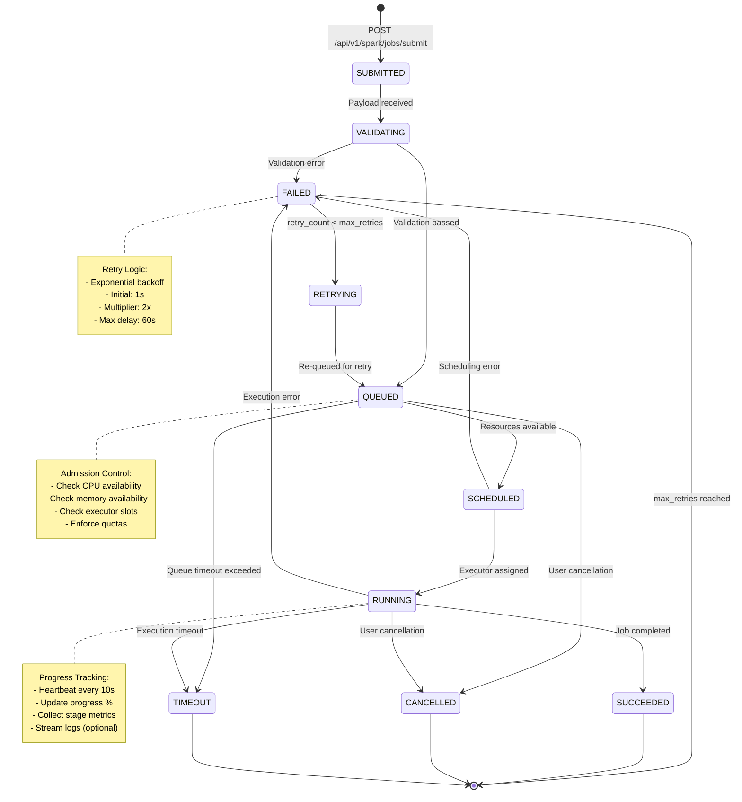

# Libra Spark Facade Service - High-Level Design

**Version:** 1.0
**Date:** 2025-12-02
**Status:** Draft

---

## Table of Contents

1. [System Overview](#system-overview)
2. [Architecture Principles](#architecture-principles)
3. [System Architecture](#system-architecture)
4. [Job Lifecycle State Machine](#job-lifecycle-state-machine)
5. [Execution Modes](#execution-modes)
6. [Resource Management](#resource-management)
7. [Data Flow](#data-flow)
8. [API Design](#api-design)
9. [Deployment Architecture](#deployment-architecture)
10. [Security Model](#security-model)
11. [Observability](#observability)

---

## System Overview

### Purpose
Libra is a production-grade RESTful facade service for Apache Spark that provides:
- Asynchronous job submission with immediate response
- Intelligent resource management and admission control
- Multiple execution strategies (in-cluster, spark-submit, Kubernetes Operator)
- Job lifecycle tracking and observability

### Key Features
- ✅ **Async Job Submission**: Submit jobs via REST API, get immediate `jobId`, query status later
- ✅ **Resource Awareness**: Monitors K8s resources, queues jobs when unavailable
- ✅ **Hybrid Execution**: Three execution modes with customer choice or auto-selection
- ✅ **Fault Tolerance**: Persistent queue, automatic retries, graceful failure handling
- ✅ **Multi-Tenancy Ready**: Namespace isolation, per-user quotas (Phase 4)
- ✅ **Production-Grade**: Metrics, tracing, structured logging, health checks

### Non-Goals
- ❌ Real-time streaming job management (use dedicated streaming platforms)
- ❌ Custom Spark scheduler implementation (leverage Spark's FAIR scheduler)
- ❌ Data storage/warehousing (jobs interact with external data sources)
- ❌ Workflow orchestration (use Airflow/Prefect for DAGs)

---

## Architecture Principles

### 1. Reactive First
**Principle:** All I/O operations are non-blocking using Project Reactor

**Rationale:**
- Consistent with Spring WebFlux architecture
- Built-in backpressure prevents resource exhaustion
- Better composability for async operations

**Example:**
```java
public Mono<JobSubmitResponse> submitJob(SparkJobRequest request) {
    return Mono.just(generateJobId())
        .doOnNext(id -> jobQueue.enqueue(id, request))
        .map(id -> new JobSubmitResponse(id, QUEUED));
}
```

### 2. Customer Choice with Smart Defaults
**Principle:** Support explicit execution mode selection with intelligent auto-selection

**Execution Modes:**
- `in-cluster`: Fast, shared resources, low isolation
- `spark-submit`: Medium latency, process isolation
- `kubernetes`: High latency, pod isolation, production-grade

**Auto-Selection Logic:**
```
IF executorCount > 20 OR totalMemory > 100GB THEN kubernetes
ELSE IF executorCount > 5 OR totalMemory > 32GB THEN spark-submit
ELSE in-cluster
```

### 3. Resource Awareness
**Principle:** Never over-commit resources beyond K8s limits

**Implementation:**
- Read K8s resource limits via Downward API
- Track active job resource usage
- Admit/queue/reject jobs based on availability

### 4. Fail Fast, Retry Smart
**Principle:** Validate early, fail fast, retry with exponential backoff

**Validation:**
- Schema validation at API boundary
- Resource requirement calculation before queuing
- Authorization checks before admission

**Retry Strategy:**
- Initial delay: 1s
- Backoff multiplier: 2x
- Max delay: 60s
- Max retries: 3 (configurable)

### 5. Observability by Design
**Principle:** Every operation is traced, metered, and logged

**Standards:**
- **Traces:** OpenTelemetry with distributed tracing
- **Metrics:** Prometheus with Grafana dashboards
- **Logs:** Structured JSON logs with correlation IDs

---

## System Architecture

### Component Diagram

```
┌─────────────────────────────────────────────────────────────────┐
│                         Libra Service (K8s Pod)                  │
├─────────────────────────────────────────────────────────────────┤
│                                                                   │
│  ┌──────────────────────────────────────────────────────────┐   │
│  │                    API Layer (WebFlux)                    │   │
│  ├──────────────────────────────────────────────────────────┤   │
│  │  SparkJobController  │  JobStatusController              │   │
│  │  - POST /jobs/submit │  - GET /jobs/{id}                 │   │
│  │  - Returns Mono<T>   │  - DELETE /jobs/{id}              │   │
│  └──────────────────────────────────────────────────────────┘   │
│                              ↓                                    │
│  ┌──────────────────────────────────────────────────────────┐   │
│  │                   Service Layer (Async)                   │   │
│  ├──────────────────────────────────────────────────────────┤   │
│  │  JobSubmissionService                                     │   │
│  │  - validateJob()                                          │   │
│  │  - calculateResources()                                   │   │
│  │  - admitJob() → ADMIT/QUEUE/REJECT                        │   │
│  └──────────────────────────────────────────────────────────┘   │
│                              ↓                                    │
│  ┌──────────────────────────────────────────────────────────┐   │
│  │                    Queue Layer (Reactive)                 │   │
│  ├──────────────────────────────────────────────────────────┤   │
│  │  JobQueue (Redis Streams)                                 │   │
│  │  - enqueue(jobId, payload)                                │   │
│  │  - consume() → Flux<QueuedJob>                            │   │
│  │  - ack(jobId)                                             │   │
│  └──────────────────────────────────────────────────────────┘   │
│                              ↓                                    │
│  ┌──────────────────────────────────────────────────────────┐   │
│  │               Execution Strategy Factory                  │   │
│  ├──────────────────────────────────────────────────────────┤   │
│  │  selectExecutor(request) → JobExecutor                    │   │
│  │  - InClusterExecutor                                      │   │
│  │  - SparkSubmitExecutor                                    │   │
│  │  - KubernetesOperatorExecutor                             │   │
│  └──────────────────────────────────────────────────────────┘   │
│                              ↓                                    │
│  ┌──────────────────────────────────────────────────────────┐   │
│  │                   Job Executor Layer                      │   │
│  ├──────────────────────────────────────────────────────────┤   │
│  │  InClusterExecutor:                                       │   │
│  │  - executeJob() in current JVM                            │   │
│  │  - Uses SparkSessionManager                               │   │
│  │                                                            │   │
│  │  SparkSubmitExecutor:                                     │   │
│  │  - Launches spark-submit process                          │   │
│  │  - Monitors process output                                │   │
│  │                                                            │   │
│  │  KubernetesOperatorExecutor:                              │   │
│  │  - Creates SparkApplication CRD                           │   │
│  │  - Polls K8s API for status                               │   │
│  └──────────────────────────────────────────────────────────┘   │
│                              ↓                                    │
│  ┌──────────────────────────────────────────────────────────┐   │
│  │                  State Management Layer                   │   │
│  ├──────────────────────────────────────────────────────────┤   │
│  │  JobStatusTracker                                         │   │
│  │  - State machine enforcement                              │   │
│  │  - Status updates → Database + Redis                      │   │
│  │  - Webhook notifications                                  │   │
│  └──────────────────────────────────────────────────────────┘   │
│                                                                   │
└─────────────────────────────────────────────────────────────────┘
                              ↓
┌─────────────────────────────────────────────────────────────────┐
│                     External Dependencies                        │
├─────────────────────────────────────────────────────────────────┤
│  Redis (Queue)  │  PostgreSQL (History)  │  K8s API Server      │
│  Prometheus     │  S3/HDFS (Jars)        │  Spark Operator      │
└─────────────────────────────────────────────────────────────────┘
```

### Component Responsibilities

| Component | Responsibility | Technology |
|-----------|---------------|------------|
| **API Layer** | HTTP request handling, validation, serialization | Spring WebFlux |
| **Service Layer** | Business logic, resource calculation, admission control | Spring Service |
| **Queue Layer** | Job persistence, asynchronous decoupling | Redis Streams |
| **Execution Factory** | Execution mode selection, executor routing | Strategy Pattern |
| **Executor Layer** | Actual Spark job execution, result collection | Executor Interface |
| **State Management** | Job lifecycle tracking, webhooks | State Machine |

---

## Job Lifecycle State Machine

### State Diagram



### State Transition Table

| From State | To State | Trigger | Condition | Side Effects |
|------------|----------|---------|-----------|--------------|
| SUBMITTED | VALIDATING | Auto | N/A | Log submission, assign jobId |
| VALIDATING | QUEUED | Validation success | Payload valid | Persist to DB |
| VALIDATING | FAILED | Validation error | Invalid payload | Log error, notify webhook |
| QUEUED | SCHEDULED | Resource check | Resources available | Reserve resources |
| QUEUED | CANCELLED | User action | DELETE /jobs/{id} | Release queue slot |
| QUEUED | TIMEOUT | Time elapsed | queueTime > maxQueueTime | Log timeout |
| SCHEDULED | RUNNING | Executor start | Executor assigned | Track resource usage |
| RUNNING | SUCCEEDED | Job completion | exitCode == 0 | Store result, release resources |
| RUNNING | FAILED | Job error | exitCode != 0 | Log error, release resources |
| RUNNING | CANCELLED | User action | DELETE /jobs/{id} | Kill executor, release resources |
| RUNNING | TIMEOUT | Time elapsed | runTime > maxRunTime | Kill executor, release resources |
| FAILED | RETRYING | Retry check | retryCount < maxRetries | Increment retryCount |
| RETRYING | QUEUED | Auto | N/A | Re-enqueue with backoff |

### State Persistence

```sql
-- Job status table
CREATE TABLE spark_jobs (
    job_id UUID PRIMARY KEY,
    user_id VARCHAR(255),
    execution_mode VARCHAR(20),
    status VARCHAR(20) NOT NULL,
    payload JSONB NOT NULL,
    resource_requirement JSONB,

    submitted_at TIMESTAMP DEFAULT NOW(),
    queued_at TIMESTAMP,
    scheduled_at TIMESTAMP,
    started_at TIMESTAMP,
    completed_at TIMESTAMP,

    result JSONB,
    error_message TEXT,

    retry_count INT DEFAULT 0,
    max_retries INT DEFAULT 3,
    priority INT DEFAULT 5,

    INDEX idx_status (status),
    INDEX idx_user_submitted (user_id, submitted_at DESC)
);

-- State transition history
CREATE TABLE job_state_transitions (
    id BIGSERIAL PRIMARY KEY,
    job_id UUID REFERENCES spark_jobs(job_id),
    from_state VARCHAR(20),
    to_state VARCHAR(20),
    transitioned_at TIMESTAMP DEFAULT NOW(),
    metadata JSONB,
    INDEX idx_job_id (job_id)
);
```

---

## Execution Modes

### Comparison Matrix

| Aspect | in-cluster | spark-submit | kubernetes |
|--------|-----------|--------------|------------|
| **Startup Latency** | 50-100ms | 1-5s | 10-30s |
| **Resource Isolation** | None (shared JVM) | Process-level | Pod-level |
| **Failure Domain** | Shared (one crash = all fail) | Isolated | Fully isolated |
| **Resource Limits** | Configurable max | Per-process | K8s ResourceQuota |
| **Multi-Tenancy** | Single tenant | Single tenant | Multi-tenant (namespaces) |
| **Scalability** | Limited (single pod) | Medium | Excellent (K8s scheduler) |
| **Cost Efficiency** | ⭐⭐⭐⭐⭐ | ⭐⭐⭐ | ⭐⭐ |
| **Operational Complexity** | Low | Medium | High |
| **Best For** | Interactive queries | Batch ETL | Production workloads |

### Execution Mode Selection

#### Auto-Selection Algorithm

```java
public ExecutionMode selectMode(SparkJobRequest request) {
    // Explicit customer choice takes precedence
    if (request.getExecutionMode() != null && !request.getExecutionMode().equals("auto")) {
        return ExecutionMode.valueOf(request.getExecutionMode().toUpperCase());
    }

    // Calculate resource requirements
    ResourceRequirement req = resourceCalculator.calculate(request);

    // Large jobs → Kubernetes
    if (req.getExecutorCount() > 20 || req.getTotalMemoryGB() > 100) {
        return ExecutionMode.KUBERNETES;
    }

    // Medium jobs → spark-submit
    if (req.getExecutorCount() > 5 || req.getTotalMemoryGB() > 32) {
        return ExecutionMode.SPARK_SUBMIT;
    }

    // Small jobs → in-cluster
    return ExecutionMode.IN_CLUSTER;
}
```

#### Configuration Limits

```yaml
libra:
  execution:
    modes:
      in-cluster:
        enabled: true
        limits:
          max-executors: 5
          max-memory-per-executor: 4g
          max-cores-per-executor: 2
          max-concurrent-jobs: 10

      spark-submit:
        enabled: true
        spark-home: /opt/spark
        timeout-minutes: 60

      kubernetes:
        enabled: true
        namespace: spark-jobs
        service-account: spark-operator
        image: spark:4.0.1
        ttl-seconds-after-finished: 3600
```

### In-Cluster Mode Architecture

```
┌─────────────────────────────────────────┐
│        Libra Pod (K8s)                   │
│                                          │
│  ┌────────────────────────────────────┐ │
│  │  InClusterExecutor                  │ │
│  │  - Bounded thread pool              │ │
│  │  - Max 10 concurrent jobs           │ │
│  └────────────────────────────────────┘ │
│              ↓                           │
│  ┌────────────────────────────────────┐ │
│  │  SparkSessionManager                │ │
│  │  - SHARED mode: 1 session           │ │
│  │  - ISOLATED mode: N sessions        │ │
│  └────────────────────────────────────┘ │
│              ↓                           │
│  ┌────────────────────────────────────┐ │
│  │  SparkSession (in-JVM)              │ │
│  │  - spark.executor.instances: 2-5    │ │
│  │  - spark.executor.memory: 2g-4g     │ │
│  │  - FAIR scheduler enabled           │ │
│  └────────────────────────────────────┘ │
│                                          │
└─────────────────────────────────────────┘
```

### Kubernetes Mode Architecture

```
┌─────────────────────────────────────────┐
│        Libra Pod                         │
│                                          │
│  ┌────────────────────────────────────┐ │
│  │  KubernetesOperatorExecutor         │ │
│  │  - Creates SparkApplication CRD     │ │
│  │  - Polls K8s API for status         │ │
│  └────────────────────────────────────┘ │
│              ↓                           │
└──────────────┼──────────────────────────┘
               ↓
┌──────────────────────────────────────────┐
│      Kubernetes API Server                │
└──────────────┬───────────────────────────┘
               ↓
┌──────────────────────────────────────────┐
│      Spark Operator                       │
│      - Watches SparkApplication CRDs      │
│      - Creates Driver/Executor Pods       │
└──────────────┬───────────────────────────┘
               ↓
     ┌─────────┴─────────┐
     ↓                   ↓
┌─────────┐        ┌─────────┐
│ Driver  │        │Executor │
│  Pod    │◄──────►│  Pods   │
└─────────┘        └─────────┘
```

---

## Resource Management

### Resource Monitoring Flow

```
┌──────────────────────────────────────────────────────────┐
│                 1. Job Submission                         │
│  POST /api/v1/spark/jobs/submit                          │
│  { sparkConfig: { "spark.executor.instances": "10" } }   │
└────────────────────┬─────────────────────────────────────┘
                     ↓
┌──────────────────────────────────────────────────────────┐
│                 2. Resource Calculation                   │
│  ResourceCalculator.calculate(request)                    │
│  → executorCount: 10                                      │
│  → totalMemoryGB: 80GB                                    │
│  → totalCores: 40 cores                                   │
└────────────────────┬─────────────────────────────────────┘
                     ↓
┌──────────────────────────────────────────────────────────┐
│                 3. Resource Availability Check            │
│  ResourceMonitor.canAccommodate(requirement)              │
│                                                            │
│  Current Usage:                                           │
│  - CPU: 8/16 cores (50%)                                  │
│  - Memory: 32/64 GB (50%)                                 │
│  - Jobs: 5/10                                             │
│                                                            │
│  Required:                                                │
│  - CPU: 40 cores                                          │
│  - Memory: 80 GB                                          │
│                                                            │
│  Decision: REJECT (insufficient resources)                │
└────────────────────┬─────────────────────────────────────┘
                     ↓
┌──────────────────────────────────────────────────────────┐
│                 4. Admission Decision                     │
│                                                            │
│  IF canAccommodate THEN                                   │
│    ADMIT → start immediately                              │
│  ELSE IF queueSize < maxQueueSize THEN                    │
│    QUEUE → wait for resources                             │
│  ELSE                                                      │
│    REJECT → return 429 Too Many Requests                  │
│  END IF                                                    │
└────────────────────┬─────────────────────────────────────┘
                     ↓
┌──────────────────────────────────────────────────────────┐
│                 5. Queue Processing                       │
│                                                            │
│  Background Processor (infinite reactive stream):         │
│                                                            │
│  jobQueue.consume()                                       │
│    .filter(job -> resourceMonitor.canAccommodate(job))    │
│    .flatMap(job -> executeJob(job))                       │
│    .subscribe()                                           │
└───────────────────────────────────────────────────────────┘
```

### Resource Quota Configuration

```yaml
libra:
  resources:
    # Global limits (from K8s)
    limits:
      cpu-cores: ${K8S_CPU_LIMIT:16}
      memory-gb: ${K8S_MEMORY_LIMIT:64}

    # Per-execution-mode limits
    quotas:
      in-cluster:
        max-executors-per-job: 5
        max-memory-per-executor: 4g
        max-concurrent-jobs: 10

      spark-submit:
        max-executors-per-job: 20
        max-memory-per-executor: 16g
        max-concurrent-jobs: 5

      kubernetes:
        max-executors-per-job: 100
        max-memory-per-executor: 32g
        max-concurrent-jobs: 50

    # Queue settings
    queue:
      max-size: 1000
      max-wait-time: 30m

    # Monitoring
    monitor:
      enabled: true
      poll-interval: 5s
      alert-threshold:
        cpu-percent: 90
        memory-percent: 90
```

---

## Data Flow

### Synchronous Job Submission (Phase 1)

```
┌─────────┐                                             ┌─────────┐
│ Client  │                                             │  Libra  │
└────┬────┘                                             └────┬────┘
     │                                                       │
     │  POST /api/v1/spark/jobs/submit                      │
     │─────────────────────────────────────────────────────►│
     │  { code: "...", kind: "sql", sparkConfig: {...} }    │
     │                                                       │
     │                                              [Validate]
     │                                              [Calculate Resources]
     │                                              [Check Admission]
     │                                                       │
     │                                              [Enqueue → Redis]
     │                                                       │
     │  202 Accepted                                         │
     │◄─────────────────────────────────────────────────────│
     │  { jobId: "abc-123", status: "QUEUED" }              │
     │                                                       │
     │                                                       │
     │  GET /api/v1/spark/jobs/abc-123                      │
     │─────────────────────────────────────────────────────►│
     │                                                       │
     │                                              [Query Status]
     │                                                       │
     │  200 OK                                               │
     │◄─────────────────────────────────────────────────────│
     │  { jobId: "abc-123", status: "RUNNING", progress: 45% }
     │                                                       │
     │                                                       │
     │  ... (repeat polling) ...                            │
     │                                                       │
     │                                                       │
     │  GET /api/v1/spark/jobs/abc-123                      │
     │─────────────────────────────────────────────────────►│
     │                                                       │
     │  200 OK                                               │
     │◄─────────────────────────────────────────────────────│
     │  { jobId: "abc-123", status: "SUCCEEDED",            │
     │    result: { rows: [...] } }                         │
     │                                                       │
```

### Background Job Execution (Phase 1)

```
┌────────────────┐       ┌────────────────┐       ┌────────────────┐
│  Redis Queue   │       │   Libra Pod    │       │   Spark        │
└───────┬────────┘       └───────┬────────┘       └───────┬────────┘
        │                        │                        │
        │  Consume (Flux)        │                        │
        │◄───────────────────────│                        │
        │                        │                        │
        │  QueuedJob             │                        │
        │───────────────────────►│                        │
        │                        │                        │
        │                [Check Resources]                │
        │                [Update: SCHEDULED]              │
        │                        │                        │
        │                        │  executeJob()          │
        │                        │───────────────────────►│
        │                        │                        │
        │                [Update: RUNNING]         [Execute]
        │                        │                        │
        │                        │                 [Complete]
        │                        │                        │
        │                        │  JobResult             │
        │                        │◄───────────────────────│
        │                        │                        │
        │                [Update: SUCCEEDED]              │
        │                [Store Result → DB]              │
        │                [Notify Webhooks]                │
        │                [Release Resources]              │
        │                        │                        │
        │  Ack (jobId)           │                        │
        │◄───────────────────────│                        │
        │                        │                        │
```

---

## API Design

### Job Submission

```http
POST /api/v1/spark/jobs/submit HTTP/1.1
Content-Type: application/json
Authorization: Bearer <token>

{
  "code": "spark.sql('SELECT COUNT(*) FROM users').show()",
  "kind": "sql",
  "executionMode": "in-cluster",
  "sparkConfig": {
    "spark.executor.instances": "5",
    "spark.executor.memory": "4g",
    "spark.executor.cores": "2"
  },
  "priority": 5,
  "retryPolicy": {
    "maxRetries": 3,
    "backoffMultiplier": 2
  },
  "notifications": {
    "webhook": "https://customer.com/webhooks/spark",
    "events": ["SUCCEEDED", "FAILED"]
  }
}

HTTP/1.1 202 Accepted
Content-Type: application/json
Location: /api/v1/spark/jobs/abc-123

{
  "jobId": "abc-123",
  "status": "QUEUED",
  "submittedAt": "2025-12-02T10:30:00Z",
  "estimatedStartTime": "2025-12-02T10:31:00Z"
}
```

### Job Status Query

```http
GET /api/v1/spark/jobs/abc-123 HTTP/1.1
Authorization: Bearer <token>

HTTP/1.1 200 OK
Content-Type: application/json

{
  "jobId": "abc-123",
  "status": "RUNNING",
  "executionMode": "in-cluster",
  "progress": {
    "percentage": 45,
    "currentStage": "Stage 2/4",
    "tasksCompleted": 450,
    "tasksTotal": 1000
  },
  "submittedAt": "2025-12-02T10:30:00Z",
  "queuedAt": "2025-12-02T10:30:01Z",
  "startedAt": "2025-12-02T10:30:15Z",
  "resourceUsage": {
    "cpuCores": 10,
    "memoryGB": 20
  },
  "retryCount": 0
}
```

### Job Result Retrieval

```http
GET /api/v1/spark/jobs/abc-123/result HTTP/1.1
Authorization: Bearer <token>

HTTP/1.1 200 OK
Content-Type: application/json

{
  "jobId": "abc-123",
  "status": "SUCCEEDED",
  "result": {
    "schema": {
      "fields": [
        { "name": "count", "type": "long" }
      ]
    },
    "rows": [
      { "count": 1000000 }
    ]
  },
  "executionTime": "45.2s",
  "completedAt": "2025-12-02T10:31:00Z"
}
```

### Job Cancellation

```http
DELETE /api/v1/spark/jobs/abc-123 HTTP/1.1
Authorization: Bearer <token>

HTTP/1.1 200 OK
Content-Type: application/json

{
  "jobId": "abc-123",
  "status": "CANCELLED",
  "cancelledAt": "2025-12-02T10:30:30Z"
}
```

### Job Listing

```http
GET /api/v1/spark/jobs?status=RUNNING&limit=10&offset=0 HTTP/1.1
Authorization: Bearer <token>

HTTP/1.1 200 OK
Content-Type: application/json

{
  "jobs": [
    {
      "jobId": "abc-123",
      "status": "RUNNING",
      "submittedAt": "2025-12-02T10:30:00Z",
      "executionMode": "in-cluster"
    },
    ...
  ],
  "total": 42,
  "limit": 10,
  "offset": 0
}
```

---

## Deployment Architecture

### Kubernetes Deployment

```yaml
apiVersion: apps/v1
kind: Deployment
metadata:
  name: libra
  namespace: libra-system
spec:
  replicas: 3  # Multi-instance for HA
  selector:
    matchLabels:
      app: libra
  template:
    metadata:
      labels:
        app: libra
    spec:
      serviceAccountName: libra
      containers:
      - name: libra
        image: whereq/libra:1.0.0
        ports:
        - containerPort: 8080
          name: http
        - containerPort: 8081
          name: actuator
        env:
        - name: K8S_CPU_LIMIT
          valueFrom:
            resourceFieldRef:
              resource: limits.cpu
        - name: K8S_MEMORY_LIMIT
          valueFrom:
            resourceFieldRef:
              resource: limits.memory
        - name: SPRING_PROFILES_ACTIVE
          value: production
        - name: REDIS_URL
          valueFrom:
            secretKeyRef:
              name: libra-secrets
              key: redis-url
        resources:
          requests:
            cpu: 2
            memory: 4Gi
          limits:
            cpu: 8
            memory: 16Gi
        livenessProbe:
          httpGet:
            path: /actuator/health/liveness
            port: actuator
          initialDelaySeconds: 30
          periodSeconds: 10
        readinessProbe:
          httpGet:
            path: /actuator/health/readiness
            port: actuator
          initialDelaySeconds: 20
          periodSeconds: 5
---
apiVersion: v1
kind: Service
metadata:
  name: libra
  namespace: libra-system
spec:
  selector:
    app: libra
  ports:
  - name: http
    port: 80
    targetPort: 8080
  - name: actuator
    port: 8081
    targetPort: 8081
  type: ClusterIP
---
apiVersion: autoscaling/v2
kind: HorizontalPodAutoscaler
metadata:
  name: libra-hpa
  namespace: libra-system
spec:
  scaleTargetRef:
    apiVersion: apps/v1
    kind: Deployment
    name: libra
  minReplicas: 3
  maxReplicas: 10
  metrics:
  - type: Resource
    resource:
      name: cpu
      target:
        type: Utilization
        averageUtilization: 70
  - type: Resource
    resource:
      name: memory
      target:
        type: Utilization
        averageUtilization: 80
```

### Infrastructure Components

```
┌─────────────────────────────────────────────────────────────┐
│                    Kubernetes Cluster                        │
├─────────────────────────────────────────────────────────────┤
│                                                               │
│  ┌──────────────────────────────────────────────────────┐   │
│  │              libra-system namespace                   │   │
│  │  ┌────────┐  ┌────────┐  ┌────────┐                 │   │
│  │  │ Libra  │  │ Libra  │  │ Libra  │  (3-10 replicas)│   │
│  │  │  Pod   │  │  Pod   │  │  Pod   │                 │   │
│  │  └────────┘  └────────┘  └────────┘                 │   │
│  └──────────────────────────────────────────────────────┘   │
│                                                               │
│  ┌──────────────────────────────────────────────────────┐   │
│  │              spark-jobs namespace                     │   │
│  │  ┌────────────┐  ┌────────────┐  ┌────────────┐     │   │
│  │  │ Driver Pod │  │ Driver Pod │  │ Driver Pod │     │   │
│  │  └────────────┘  └────────────┘  └────────────┘     │   │
│  │  ┌────────────┐  ┌────────────┐  ┌────────────┐     │   │
│  │  │Executor Pod│  │Executor Pod│  │Executor Pod│     │   │
│  │  └────────────┘  └────────────┘  └────────────┘     │   │
│  └──────────────────────────────────────────────────────┘   │
│                                                               │
│  ┌──────────────────────────────────────────────────────┐   │
│  │              infrastructure namespace                 │   │
│  │  ┌──────────┐  ┌────────────┐  ┌───────────┐        │   │
│  │  │  Redis   │  │ PostgreSQL │  │Prometheus │        │   │
│  │  │  Cluster │  │            │  │           │        │   │
│  │  └──────────┘  └────────────┘  └───────────┘        │   │
│  └──────────────────────────────────────────────────────┘   │
│                                                               │
└─────────────────────────────────────────────────────────────┘
```

---

## Security Model

### Authentication & Authorization

```
┌─────────────────────────────────────────────────────────────┐
│                     Security Layers                          │
├─────────────────────────────────────────────────────────────┤
│                                                               │
│  Layer 1: API Gateway Authentication                         │
│  - JWT token validation                                      │
│  - OAuth2 / OIDC integration                                 │
│  - API key validation                                        │
│                                                               │
│  Layer 2: RBAC Authorization                                 │
│  - Roles: admin, developer, viewer                           │
│  - Permissions: submit_job, view_job, cancel_job            │
│  - Resource-level access control                             │
│                                                               │
│  Layer 3: Tenant Isolation (Phase 4)                         │
│  - Namespace-based isolation                                 │
│  - Resource quotas per tenant                                │
│  - Network policies                                          │
│                                                               │
│  Layer 4: Data Security                                      │
│  - TLS for all communication                                 │
│  - Secrets management (K8s Secrets)                          │
│  - Audit logging                                             │
│                                                               │
└─────────────────────────────────────────────────────────────┘
```

### RBAC Matrix

| Role | submit_job | view_own_job | view_all_jobs | cancel_own_job | cancel_any_job | admin |
|------|-----------|--------------|---------------|----------------|----------------|-------|
| **viewer** | ❌ | ✅ | ❌ | ❌ | ❌ | ❌ |
| **developer** | ✅ | ✅ | ❌ | ✅ | ❌ | ❌ |
| **admin** | ✅ | ✅ | ✅ | ✅ | ✅ | ✅ |

---

## Observability

### Metrics

```yaml
# Prometheus metrics exposed at /actuator/prometheus
libra_job_submissions_total{status="succeeded|failed|rejected"}
libra_job_duration_seconds{execution_mode="in-cluster|spark-submit|kubernetes"}
libra_queue_size{queue="pending|scheduled"}
libra_queue_wait_time_seconds
libra_resource_usage{type="cpu|memory"}
libra_resource_limit{type="cpu|memory"}
libra_executor_count{execution_mode="..."}
libra_http_requests_total{endpoint="/api/v1/spark/jobs/submit", status="2xx|4xx|5xx"}
libra_http_request_duration_seconds
```

### Logging

```json
{
  "timestamp": "2025-12-02T10:30:00.123Z",
  "level": "INFO",
  "logger": "com.whereq.libra.service.JobSubmissionService",
  "message": "Job submitted successfully",
  "jobId": "abc-123",
  "userId": "user-456",
  "executionMode": "kubernetes",
  "resourceRequirement": {
    "cpuCores": 40,
    "memoryGB": 80
  },
  "traceId": "trace-789",
  "spanId": "span-012"
}
```

### Distributed Tracing

```
[Client] --HTTP--> [Libra API] --Redis--> [Queue] --Execute--> [Spark]
   |                  |                     |                     |
   trace-789       trace-789            trace-789            trace-789
   span-001        span-002             span-003             span-004
```

---

## Change Log

| Version | Date | Author | Changes |
|---------|------|--------|---------|
| 1.0 | 2025-12-02 | Architecture Team | Initial high-level design |
