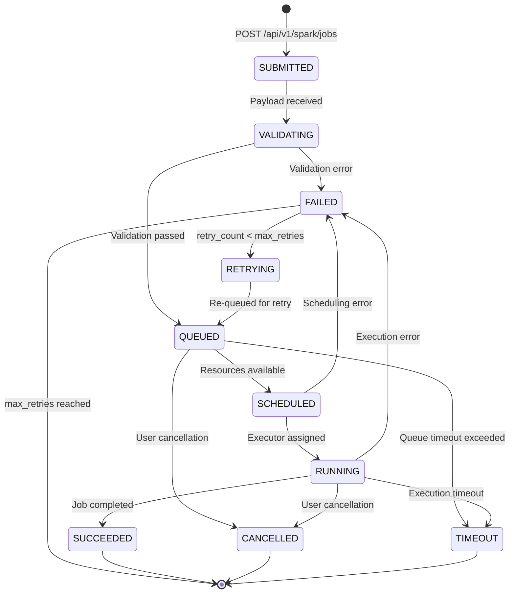

# Libra Spark Facade Service - Architecture Roadmap

**Version:** 1.0
**Date:** 2025-12-02
**Status:** Draft
**Authors:** WhereQ

---

## Executive Summary

This document outlines the architectural evolution roadmap for Libra, transforming it from a synchronous Spark job execution service into a production-grade, asynchronous, resource-aware Spark facade that supports multiple execution strategies.

### Current State
- RESTful API with Spring WebFlux (reactive HTTP layer)
- Synchronous job execution (blocks HTTP connections)
- Basic Spark session management (SHARED/ISOLATED modes)
- FAIR scheduler for job parallelism
- No explicit job queue or resource monitoring

### Target State
- Asynchronous job submission with immediate response
- Intelligent resource monitoring and admission control
- Persistent job queue with state tracking
- Hybrid execution modes: in-cluster, spark-submit, Kubernetes Operator
- Production-grade observability and fault tolerance

---

## Table of Contents

1. [Architecture Principles](#architecture-principles)
2. [Roadmap Phases](#roadmap-phases)
3. [Technical Decisions](#technical-decisions)
4. [Execution Modes Strategy](#execution-modes-strategy)
5. [Job Lifecycle Management](#job-lifecycle-management)
6. [Resource Management](#resource-management)
7. [Implementation Timeline](#implementation-timeline)
8. [Success Metrics](#success-metrics)
9. [Risk Assessment](#risk-assessment)

---

## Architecture Principles

### 1. Reactive First
- **Decision:** Continue using Project Reactor (`Schedulers.boundedElastic()`) instead of mixing with `@Async`
- **Rationale:** Maintain architectural consistency, leverage backpressure, better error handling
- **Impact:** All async operations use `Mono`/`Flux` with reactive schedulers

### 2. Customer Choice
- **Decision:** Support multiple execution modes with customer-selectable strategy
- **Options:** `in-cluster`, `spark-submit`, `kubernetes`
- **Rationale:** Different workloads have different isolation, cost, and performance requirements
- **Default:** Intelligent auto-selection based on job characteristics

### 3. Resource Awareness
- **Decision:** Implement K8s-aware resource monitoring and admission control
- **Integration:** Kubernetes Downward API for limits, metrics API for current usage
- **Behavior:** Queue jobs when resources unavailable, reject if queue full

### 4. Observability
- **Standards:** OpenTelemetry for traces, Prometheus for metrics, structured logging
- **Job Tracking:** Persistent state machine with queryable status
- **SLOs:** 99.9% job submission success, <100ms job acceptance latency

---

## Roadmap Phases

### Phase 1: Async Foundation (4-6 weeks)
**Goal:** Decouple job submission from execution

#### Deliverables
- [ ] Async job submission API (returns `jobId` immediately)
- [ ] In-memory job queue implementation
- [ ] Job status tracking service
- [ ] Background job processor with reactive scheduler
- [ ] Job status query endpoints
- [ ] Basic resource calculation from Spark configs

#### API Changes
```
POST   /api/v1/spark/jobs/submit    → Returns: { "jobId": "...", "status": "QUEUED" }
GET    /api/v1/spark/jobs/{jobId}   → Returns: { "jobId": "...", "status": "...", "progress": "..." }
DELETE /api/v1/spark/jobs/{jobId}   → Cancel job
GET    /api/v1/spark/jobs            → List jobs with filtering
```

#### New Components
```
service/
├── queue/
│   ├── JobQueue.java                    # Reactive job queue
│   ├── JobStatusTracker.java            # State machine implementation
│   └── AsyncJobExecutor.java            # Background processor
├── resource/
│   ├── ResourceCalculator.java          # Parse spark configs
│   └── ResourceRequirement.java         # Resource model
└── model/
    ├── JobStatus.java (enum)            # State enumeration
    └── QueuedJob.java                   # Queue entry model
```

#### Success Criteria
- ✅ HTTP requests return in <100ms regardless of job duration
- ✅ Jobs execute in background without blocking
- ✅ Status queryable via API
- ✅ Job cancellation works correctly

---

### Phase 2: Production Hardening (6-8 weeks)
**Goal:** Add persistence, resource monitoring, and fault tolerance

#### Deliverables
- [ ] Persistent job queue (Redis Streams or PostgreSQL)
- [ ] K8s resource monitoring integration
- [ ] Admission control (reject/queue based on resources)
- [ ] Job retry logic with exponential backoff
- [ ] Webhook notifications for job state changes
- [ ] Database schema for job history
- [ ] Metrics and observability instrumentation

#### Infrastructure
```yaml
# Redis deployment
apiVersion: apps/v1
kind: Deployment
metadata:
  name: libra-redis
spec:
  replicas: 1
  template:
    spec:
      containers:
      - name: redis
        image: redis:7-alpine

# PostgreSQL for job history
apiVersion: apps/v1
kind: StatefulSet
metadata:
  name: libra-postgres
```

#### Database Schema
```sql
CREATE TABLE spark_jobs (
    job_id UUID PRIMARY KEY,
    user_id VARCHAR(255),
    execution_mode VARCHAR(20),
    payload JSONB NOT NULL,
    status VARCHAR(20) NOT NULL,
    resource_requirement JSONB,
    submitted_at TIMESTAMP DEFAULT NOW(),
    queued_at TIMESTAMP,
    started_at TIMESTAMP,
    completed_at TIMESTAMP,
    result JSONB,
    error_message TEXT,
    retry_count INT DEFAULT 0,
    max_retries INT DEFAULT 3,
    priority INT DEFAULT 5,
    INDEX idx_status (status),
    INDEX idx_user (user_id),
    INDEX idx_submitted (submitted_at DESC)
);

CREATE TABLE job_state_transitions (
    id BIGSERIAL PRIMARY KEY,
    job_id UUID REFERENCES spark_jobs(job_id),
    from_state VARCHAR(20),
    to_state VARCHAR(20),
    transitioned_at TIMESTAMP DEFAULT NOW(),
    metadata JSONB
);
```

#### Configuration
```yaml
# application.yml
libra:
  queue:
    type: redis  # or postgresql, memory
    persistence: true
    max-queued-jobs: 1000

  resources:
    monitor:
      enabled: true
      poll-interval: 5s
      source: kubernetes-downward-api  # or prometheus
    limits:
      cpu-cores: ${K8S_CPU_LIMIT:16}
      memory-gb: ${K8S_MEMORY_LIMIT:64}
      max-concurrent-jobs: 10

  retry:
    max-attempts: 3
    backoff:
      initial-interval: 1s
      multiplier: 2
      max-interval: 60s
```

#### Success Criteria
- ✅ Jobs survive service restart
- ✅ Resource limits respected (no OOM kills)
- ✅ Failed jobs automatically retry
- ✅ 99.9% job submission success rate

---

### Phase 3: Hybrid Execution Modes (8-10 weeks)
**Goal:** Support in-cluster queue + Spark Operator execution

#### Deliverables
- [ ] Execution mode abstraction layer
- [ ] In-cluster executor with resource limits
- [ ] Kubernetes Operator executor implementation
- [ ] Smart execution mode selection
- [ ] Per-mode resource quotas
- [ ] Execution mode benchmarking dashboard

#### Execution Strategy Matrix

| Execution Mode | Isolation | Startup Latency | Resource Efficiency | Fault Tolerance | Use Case |
|----------------|-----------|-----------------|---------------------|-----------------|----------|
| **in-cluster** | Shared JVM | <100ms | High (shared resources) | Medium | Interactive queries, small batch |
| **spark-submit** | Process | 1-5s | Medium | Medium | Medium batch jobs |
| **kubernetes** | Pod | 10-30s | Low (separate pods) | High (K8s native) | Large batch, production workloads |

#### API Enhancement
```json
POST /api/v1/spark/jobs/submit
{
  "code": "spark.sql('SELECT COUNT(*) FROM users').show()",
  "kind": "sql",
  "executionMode": "kubernetes",  // NEW: in-cluster | spark-submit | kubernetes | auto
  "sparkConfig": {
    "spark.executor.instances": "10",
    "spark.executor.memory": "8g",
    "spark.executor.cores": "4"
  },
  "priority": 5,  // NEW: 1-10 (10 = highest)
  "retryPolicy": {  // NEW
    "maxRetries": 3,
    "backoffMultiplier": 2
  },
  "notifications": {  // NEW
    "webhook": "https://customer.com/spark-callback",
    "events": ["SUCCEEDED", "FAILED"]
  }
}
```

#### Execution Mode Selection Logic
```java
public ExecutionMode selectMode(SparkJobRequest request) {
    if (request.getExecutionMode() != null) {
        return request.getExecutionMode();  // Explicit customer choice
    }

    // Auto-selection
    ResourceRequirement req = calculateRequirement(request);

    if (req.getExecutorCount() > 20 || req.getTotalMemoryGB() > 100) {
        return ExecutionMode.KUBERNETES;  // Large job → K8s
    } else if (req.requiresIsolation() || req.getTotalMemoryGB() > 32) {
        return ExecutionMode.SPARK_SUBMIT;  // Medium → spark-submit
    } else {
        return ExecutionMode.IN_CLUSTER;  // Small → in-cluster queue
    }
}
```

#### Kubernetes Operator Integration
```java
@Service
public class KubernetesOperatorExecutor implements JobExecutor {

    @Autowired
    private KubernetesClient k8sClient;

    @Override
    public Mono<JobResult> executeJob(QueuedJob job) {
        return Mono.fromCallable(() -> {
            SparkApplication sparkApp = buildSparkApplication(job);
            k8sClient.resources(SparkApplication.class)
                .inNamespace("spark-jobs")
                .create(sparkApp);
            return sparkApp.getMetadata().getName();
        })
        .subscribeOn(Schedulers.boundedElastic())
        .flatMap(appName -> pollSparkApplicationStatus(appName));
    }

    private SparkApplication buildSparkApplication(QueuedJob job) {
        return new SparkApplicationBuilder()
            .withNewMetadata()
                .withName("spark-job-" + job.getId())
                .withNamespace("spark-jobs")
            .endMetadata()
            .withNewSpec()
                .withType("Scala")
                .withMode("cluster")
                .withImage("spark:4.0.1")
                .withMainClass(job.getMainClass())
                .withMainApplicationFile(job.getJarPath())
                .withNewDriver()
                    .withCores(job.getDriverCores())
                    .withMemory(job.getDriverMemory())
                .endDriver()
                .withNewExecutor()
                    .withCores(job.getExecutorCores())
                    .withInstances(job.getExecutorCount())
                    .withMemory(job.getExecutorMemory())
                .endExecutor()
            .endSpec()
            .build();
    }
}
```

#### Success Criteria
- ✅ Customers can choose execution mode via API
- ✅ Auto-selection works for 95% of jobs
- ✅ K8s operator integration stable (99.5% success rate)
- ✅ Resource isolation verified (no cross-job interference)

---

### Phase 4: Enterprise Features (Optional, 10-12 weeks)
**Goal:** Multi-tenancy, cost tracking, advanced scheduling

#### Deliverables
- [ ] Multi-tenant namespace isolation
- [ ] Cost tracking per user/team
- [ ] Priority queues with preemption
- [ ] Job dependencies (DAG execution)
- [ ] Spot instance support for K8s mode
- [ ] Advanced autoscaling (queue-depth based HPA)
- [ ] Job templates and reusable configs
- [ ] SLA enforcement (max queue time, priority boost)

#### Multi-Tenancy Model
```yaml
libra:
  tenancy:
    enabled: true
    isolation-level: namespace  # namespace | shared | dedicated-cluster
    quotas:
      default:
        max-concurrent-jobs: 5
        max-cpu-cores: 32
        max-memory-gb: 128
      premium:
        max-concurrent-jobs: 20
        max-cpu-cores: 128
        max-memory-gb: 512
```

---

## Technical Decisions

### Decision 1: Reactive Pattern (Reactor) vs @Async
**Status:** APPROVED

**Decision:** Use Project Reactor's `Schedulers.boundedElastic()` for all async operations

**Rationale:**
- Maintains architectural consistency with existing WebFlux implementation
- Built-in backpressure support prevents resource exhaustion
- Better composability with existing reactive code
- Native error handling with reactive operators

**Alternatives Considered:**
- `@Async` with `CompletableFuture`: Rejected due to mixed paradigm complexity
- Virtual threads (Java 21): Future consideration for Phase 4

**Implementation:**
```java
// Pattern: Reactive job submission
public Mono<String> submitJob(SparkJobRequest request) {
    String jobId = generateJobId();
    return Mono.just(jobId)
        .doOnNext(id -> jobQueue.enqueue(id, request))
        .doOnNext(id -> statusTracker.updateStatus(id, QUEUED));
}

// Pattern: Background job processing
@PostConstruct
public void startJobProcessor() {
    jobQueue.consumeAsFlux()
        .flatMap(job -> executeJob(job)
            .subscribeOn(Schedulers.boundedElastic())
            .doOnSuccess(result -> updateStatus(job, SUCCEEDED))
            .onErrorResume(e -> handleError(job, e))
        )
        .subscribe();  // Infinite processing stream
}
```

---

### Decision 2: Queue Persistence Technology
**Status:** APPROVED (Phase 2)

**Decision:** Use Redis Streams for job queue

**Rationale:**
- Native persistence with AOF/RDB
- Consumer groups for multi-instance scalability
- Built-in TTL for automatic cleanup
- <5ms latency for enqueue/dequeue operations
- Simpler than Kafka for our use case

**Alternatives Considered:**
| Technology | Pros | Cons | Verdict |
|------------|------|------|---------|
| **Redis Streams** | Fast, persistent, simple | Single point of failure (without cluster) | ✅ SELECTED |
| **PostgreSQL** | ACID, queryable, existing infra | Slower (20-50ms latency) | Backup option |
| **Apache Kafka** | High throughput, event sourcing | Complex setup, overkill | Rejected |
| **In-memory** | Fastest, simple | No persistence | Dev/test only |

**Fallback Strategy:** Provide pluggable interface, allow PostgreSQL for compliance-heavy environments

---

### Decision 3: Hybrid Execution Modes
**Status:** APPROVED (Phase 3)

**Decision:** Support three execution modes with customer choice

**Modes:**
1. **in-cluster**: Execute in Libra's JVM with resource limits (your original proposal)
2. **spark-submit**: Launch separate process (existing implementation)
3. **kubernetes**: Create SparkApplication CRD via Operator (new)

**Customer Control:**
```json
{
  "executionMode": "kubernetes",  // Explicit selection
  "executionMode": "auto"         // Let Libra decide
}
```

**Auto-Selection Rules:**
- `executorCount > 20` OR `totalMemory > 100GB` → `kubernetes`
- `executorCount > 5` OR `totalMemory > 32GB` → `spark-submit`
- Otherwise → `in-cluster`

**Configuration:**
```yaml
libra:
  execution:
    modes:
      in-cluster:
        enabled: true
        max-executors: 5
        max-memory-per-executor: 4g
      spark-submit:
        enabled: true
      kubernetes:
        enabled: true
        namespace: spark-jobs
```

---

### Decision 4: Resource Monitoring Approach
**Status:** APPROVED (Phase 2)

**Decision:** Use Kubernetes Downward API for resource limits

**Implementation:**
```yaml
# Deployment manifest
env:
  - name: K8S_CPU_LIMIT
    valueFrom:
      resourceFieldRef:
        resource: limits.cpu
  - name: K8S_MEMORY_LIMIT
    valueFrom:
      resourceFieldRef:
        resource: limits.memory
```

```java
@Component
public class ResourceMonitor {
    private final int cpuLimit;
    private final long memoryLimit;
    private final ConcurrentHashMap<String, ResourceUsage> activeJobs;

    public ResourceMonitor(@Value("${K8S_CPU_LIMIT:16}") int cpuLimit,
                          @Value("${K8S_MEMORY_LIMIT:64}") long memoryLimit) {
        this.cpuLimit = cpuLimit;
        this.memoryLimit = memoryLimit;
        this.activeJobs = new ConcurrentHashMap<>();
    }

    public boolean canAccommodate(ResourceRequirement required) {
        ResourceUsage current = calculateCurrentUsage();
        return (current.getCpuCores() + required.getCpuCores() <= cpuLimit) &&
               (current.getMemoryGB() + required.getMemoryGB() <= memoryLimit);
    }
}
```

---

## Execution Modes Strategy

### Mode Comparison

| Aspect | in-cluster | spark-submit | kubernetes |
|--------|-----------|--------------|------------|
| **Startup Time** | 50-100ms | 1-5s | 10-30s |
| **Resource Isolation** | None (shared JVM) | Process-level | Pod-level (strong) |
| **Resource Efficiency** | ⭐⭐⭐⭐⭐ (shared) | ⭐⭐⭐ | ⭐⭐ (separate pods) |
| **Fault Tolerance** | ⭐⭐ | ⭐⭐⭐ | ⭐⭐⭐⭐⭐ (K8s retries) |
| **Multi-Tenancy** | ⭐ | ⭐⭐ | ⭐⭐⭐⭐⭐ (namespaces) |
| **Scalability** | Limited (single pod) | Medium | Excellent (K8s native) |
| **Cost** | $ | $$ | $$$ |
| **Complexity** | Low | Medium | High |

### Recommended Usage

#### in-cluster Mode
**Best For:**
- Interactive SQL queries
- Small data exploration
- Development/testing
- Cost-sensitive workloads

**Limitations:**
- Max 5 executors per job
- Max 4GB memory per executor
- Shared failure domain (one OOM kills all jobs)

**Example:**
```json
{
  "code": "SELECT COUNT(*) FROM users WHERE created_at > '2024-01-01'",
  "kind": "sql",
  "executionMode": "in-cluster"
}
```

#### spark-submit Mode
**Best For:**
- Medium batch jobs
- ETL pipelines
- ML training (single node)
- Legacy compatibility

**Example:**
```json
{
  "kind": "jar",
  "executionMode": "spark-submit",
  "jarPath": "s3://bucket/etl-job.jar",
  "mainClass": "com.example.ETLJob",
  "sparkConfig": {
    "spark.executor.instances": "10",
    "spark.executor.memory": "8g"
  }
}
```

#### kubernetes Mode
**Best For:**
- Production workloads
- Large-scale batch processing
- Compliance-required isolation
- Multi-tenant environments

**Example:**
```json
{
  "kind": "jar",
  "executionMode": "kubernetes",
  "jarPath": "s3://bucket/batch-processor.jar",
  "mainClass": "com.example.BatchProcessor",
  "sparkConfig": {
    "spark.executor.instances": "50",
    "spark.executor.memory": "16g",
    "spark.kubernetes.namespace": "team-alpha"
  }
}
```

---

## Job Lifecycle Management

### State Machine



### State Definitions

| State | Description | Timeout | Allowed Transitions | Customer Visible |
|-------|-------------|---------|---------------------|------------------|
| **SUBMITTED** | Job received via API | 1s | VALIDATING, FAILED | Yes |
| **VALIDATING** | Schema, auth, quota checks | 5s | QUEUED, FAILED | Yes |
| **QUEUED** | Waiting for resources | Configurable (default: 30m) | SCHEDULED, CANCELLED, TIMEOUT | Yes |
| **SCHEDULED** | Resources allocated, preparing | 30s | RUNNING, FAILED | Yes |
| **RUNNING** | Job actively executing | Job-specific (default: 60m) | SUCCEEDED, FAILED, CANCELLED, TIMEOUT | Yes |
| **SUCCEEDED** | Completed successfully | N/A | N/A | Yes |
| **FAILED** | Terminated with error | N/A | RETRYING | Yes |
| **CANCELLED** | User-initiated termination | N/A | N/A | Yes |
| **TIMEOUT** | Exceeded max time | N/A | N/A | Yes |
| **RETRYING** | Re-attempting after failure | 1s | QUEUED | Yes |

### State Transition Rules

```java
public class JobStateMachine {
    private static final Map<JobStatus, Set<JobStatus>> ALLOWED_TRANSITIONS = Map.of(
        SUBMITTED,   Set.of(VALIDATING, FAILED),
        VALIDATING,  Set.of(QUEUED, FAILED),
        QUEUED,      Set.of(SCHEDULED, CANCELLED, TIMEOUT),
        SCHEDULED,   Set.of(RUNNING, FAILED),
        RUNNING,     Set.of(SUCCEEDED, FAILED, CANCELLED, TIMEOUT),
        FAILED,      Set.of(RETRYING),
        RETRYING,    Set.of(QUEUED)
    );

    public void transition(String jobId, JobStatus toStatus) {
        JobStatus fromStatus = getCurrentStatus(jobId);

        if (!ALLOWED_TRANSITIONS.get(fromStatus).contains(toStatus)) {
            throw new IllegalStateTransitionException(
                String.format("Cannot transition from %s to %s", fromStatus, toStatus)
            );
        }

        updateStatus(jobId, toStatus);
        logTransition(jobId, fromStatus, toStatus);
        notifyWebhooks(jobId, toStatus);
    }
}
```

---

## Resource Management

### Resource Calculation

```java
@Service
public class ResourceCalculator {

    public ResourceRequirement calculateRequirement(SparkJobRequest request) {
        Map<String, String> sparkConfig = request.getSparkConfig();

        int executorCount = parseInt(sparkConfig.getOrDefault("spark.executor.instances", "2"));
        int executorCores = parseInt(sparkConfig.getOrDefault("spark.executor.cores", "2"));
        long executorMemoryMB = parseMemory(sparkConfig.getOrDefault("spark.executor.memory", "2g"));

        int driverCores = parseInt(sparkConfig.getOrDefault("spark.driver.cores", "1"));
        long driverMemoryMB = parseMemory(sparkConfig.getOrDefault("spark.driver.memory", "2g"));

        return ResourceRequirement.builder()
            .executorCount(executorCount)
            .totalCores(executorCount * executorCores + driverCores)
            .totalMemoryMB(executorCount * executorMemoryMB + driverMemoryMB)
            .build();
    }

    private long parseMemory(String memory) {
        // Parse formats: "2g", "2048m", "2048000k"
        Pattern pattern = Pattern.compile("(\\d+)([gmk])?");
        Matcher matcher = pattern.matcher(memory.toLowerCase());
        if (!matcher.matches()) {
            throw new IllegalArgumentException("Invalid memory format: " + memory);
        }

        long value = Long.parseLong(matcher.group(1));
        String unit = matcher.group(2);

        return switch (unit) {
            case "g" -> value * 1024;
            case "m" -> value;
            case "k" -> value / 1024;
            default -> value;
        };
    }
}
```

### Admission Control

```java
@Service
public class AdmissionController {

    @Autowired
    private ResourceMonitor resourceMonitor;

    @Autowired
    private JobQueue jobQueue;

    public Mono<AdmissionDecision> admitJob(SparkJobRequest request) {
        ResourceRequirement required = calculateRequirement(request);

        return Mono.fromCallable(() -> {
            if (resourceMonitor.canAccommodate(required)) {
                return AdmissionDecision.ADMIT;
            } else if (jobQueue.size() < MAX_QUEUE_SIZE) {
                return AdmissionDecision.QUEUE;
            } else {
                return AdmissionDecision.REJECT;
            }
        }).subscribeOn(Schedulers.boundedElastic());
    }

    public enum AdmissionDecision {
        ADMIT,   // Resources available, start immediately
        QUEUE,   // Resources unavailable, add to queue
        REJECT   // Queue full, reject job
    }
}
```

### Resource Monitoring

```java
@Component
public class ResourceMonitor {

    private final int cpuLimitCores;
    private final long memoryLimitMB;
    private final ConcurrentHashMap<String, ResourceUsage> activeJobs = new ConcurrentHashMap<>();

    @Scheduled(fixedRate = 5000)  // Poll every 5 seconds
    public void updateResourceUsage() {
        ResourceUsage current = calculateCurrentUsage();
        logger.info("Current usage: CPU={}/{} cores, Memory={}/{} MB",
            current.getCpuCores(), cpuLimitCores,
            current.getMemoryMB(), memoryLimitMB);

        // Emit metrics
        meterRegistry.gauge("libra.resources.cpu.used", current.getCpuCores());
        meterRegistry.gauge("libra.resources.cpu.limit", cpuLimitCores);
        meterRegistry.gauge("libra.resources.memory.used", current.getMemoryMB());
        meterRegistry.gauge("libra.resources.memory.limit", memoryLimitMB);
    }

    private ResourceUsage calculateCurrentUsage() {
        return activeJobs.values().stream()
            .reduce(ResourceUsage.ZERO, ResourceUsage::add);
    }

    public void trackJob(String jobId, ResourceRequirement requirement) {
        activeJobs.put(jobId, new ResourceUsage(requirement));
    }

    public void releaseJob(String jobId) {
        activeJobs.remove(jobId);
    }
}
```

---

## Implementation Timeline

### Phase 1: Async Foundation (Weeks 1-6)

| Week | Milestone | Deliverables |
|------|-----------|--------------|
| 1-2 | Core infrastructure | JobQueue, JobStatusTracker, JobStatus enum |
| 3-4 | Async API | New controller endpoints, reactive job submission |
| 5 | Background processor | Reactive job executor with Schedulers.boundedElastic() |
| 6 | Testing & documentation | Integration tests, API documentation |

**Key Dependencies:**
- None (builds on existing codebase)

**Risk:** Low

---

### Phase 2: Production Hardening (Weeks 7-14)

| Week | Milestone | Deliverables |
|------|-----------|--------------|
| 7-8 | Redis integration | Redis Streams queue, connection pool |
| 9-10 | K8s resource monitoring | Downward API integration, ResourceMonitor |
| 11-12 | Admission control | AdmissionController, queue/reject logic |
| 13 | Retry & webhooks | Retry logic, webhook notification service |
| 14 | Observability | Prometheus metrics, structured logging |

**Key Dependencies:**
- Redis deployment in K8s cluster
- PostgreSQL for job history (optional)

**Risk:** Medium (external dependencies)

---

### Phase 3: Hybrid Execution Modes (Weeks 15-24)

| Week | Milestone | Deliverables |
|------|-----------|--------------|
| 15-16 | Execution abstraction | JobExecutor interface, ExecutionStrategyFactory |
| 17-18 | In-cluster executor | Resource-limited in-JVM executor |
| 19-21 | K8s Operator integration | SparkApplication CRD client, status polling |
| 22-23 | Smart selection | Auto-mode logic, benchmarking |
| 24 | Documentation | Customer guide, decision matrix |

**Key Dependencies:**
- Spark Operator installed in K8s cluster
- Service account with permissions to create SparkApplications

**Risk:** High (K8s Operator complexity)

---

### Phase 4: Enterprise Features (Weeks 25-36, Optional)

| Week | Milestone | Deliverables |
|------|-----------|--------------|
| 25-28 | Multi-tenancy | Namespace isolation, quota management |
| 29-30 | Cost tracking | Resource usage metrics, billing API |
| 31-32 | Priority queues | Priority-based scheduling, preemption |
| 33-34 | Job dependencies | DAG execution engine |
| 35-36 | Advanced features | Spot instances, autoscaling |

**Key Dependencies:**
- Phase 3 completion
- Cost allocation model defined

**Risk:** Medium (business requirements)

---

## Success Metrics

### Phase 1 KPIs
- ✅ Job submission latency: <100ms (p95)
- ✅ API availability: >99.9%
- ✅ Job status query latency: <50ms (p95)
- ✅ Zero lost jobs during deployment

### Phase 2 KPIs
- ✅ Job persistence: 100% (survive restarts)
- ✅ Resource limit violations: 0
- ✅ Failed job retry success rate: >80%
- ✅ Queue wait time: <5 minutes (p95)

### Phase 3 KPIs
- ✅ K8s operator job success rate: >99.5%
- ✅ Execution mode auto-selection accuracy: >95%
- ✅ Cross-mode job migration time: <1 minute

### Phase 4 KPIs
- ✅ Multi-tenant isolation: 100% (no cross-tenant access)
- ✅ Cost tracking accuracy: >99%
- ✅ Priority queue fairness: Gini coefficient <0.3

---

## Risk Assessment

### Technical Risks

| Risk | Probability | Impact | Mitigation |
|------|-------------|--------|------------|
| **Redis single point of failure** | Medium | High | Use Redis Sentinel or Cluster mode |
| **K8s Operator learning curve** | High | Medium | Allocate extra time, prototype early |
| **Resource calculation inaccuracy** | Medium | Medium | Add calibration phase, collect metrics |
| **Reactive programming complexity** | Medium | Low | Team training, code reviews |
| **Backward compatibility breaks** | Low | High | Versioned API, deprecation notices |

### Operational Risks

| Risk | Probability | Impact | Mitigation |
|------|-------------|--------|------------|
| **Queue buildup during outage** | Medium | High | Dead letter queue, max queue size |
| **Memory leaks in long-running jobs** | Medium | Medium | Job timeout, memory profiling |
| **K8s cluster resource exhaustion** | Low | High | Resource quotas, admission webhooks |
| **Customer confusion with modes** | High | Low | Clear documentation, sensible defaults |

---

## Appendix

### A. API Examples

See [API_EXAMPLES.md](./API_EXAMPLES.md)

### B. Configuration Reference

See [CONFIGURATION.md](./CONFIGURATION.md)

### C. Deployment Guide

See [DEPLOYMENT.md](./DEPLOYMENT.md)

### D. Troubleshooting

See [TROUBLESHOOTING.md](./TROUBLESHOOTING.md)

---

## Change Log

| Version | Date | Author | Changes |
|---------|------|--------|---------|
| 1.0 | 2025-12-02 | Architecture Team | Initial roadmap |

---

## Approval

| Role | Name | Signature | Date |
|------|------|-----------|------|
| Tech Lead | | | |
| Product Owner | | | |
| Engineering Manager | | | |
